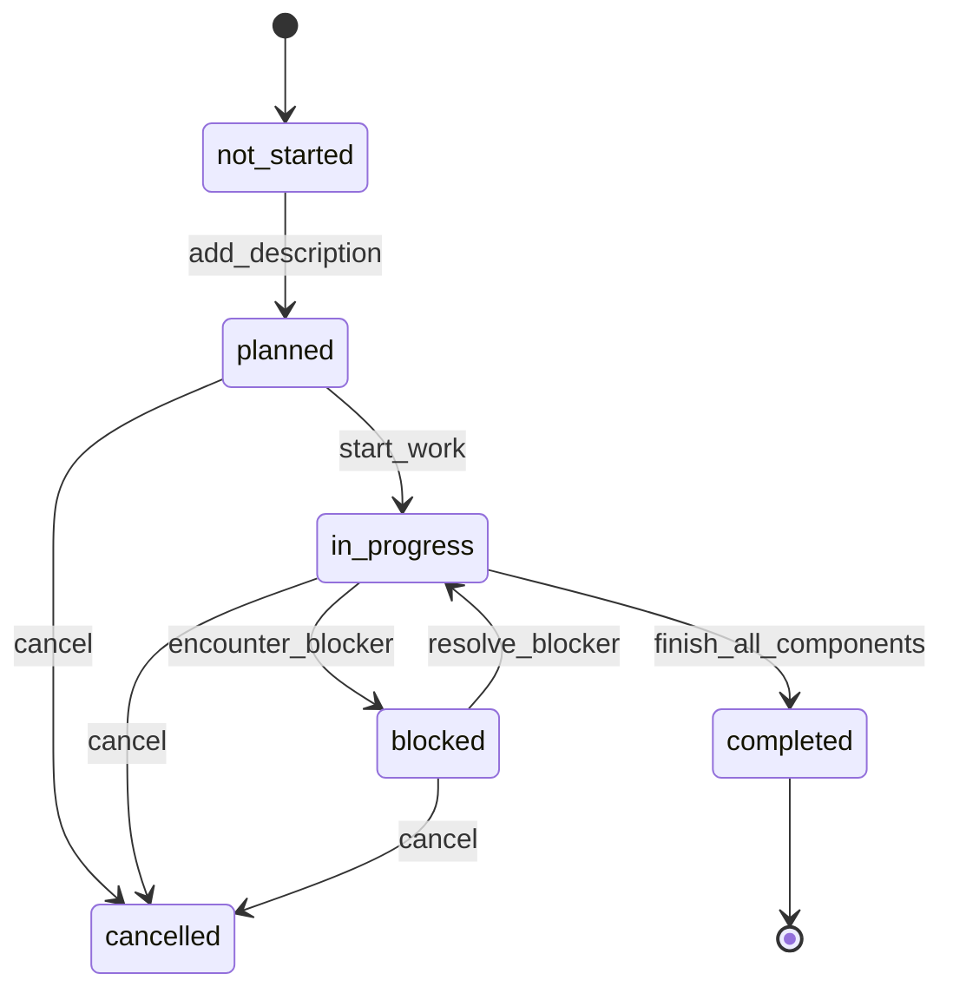
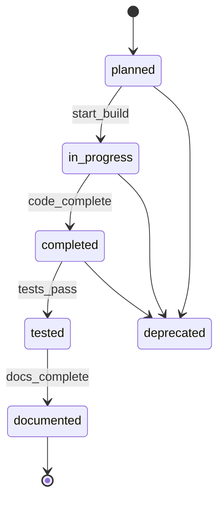
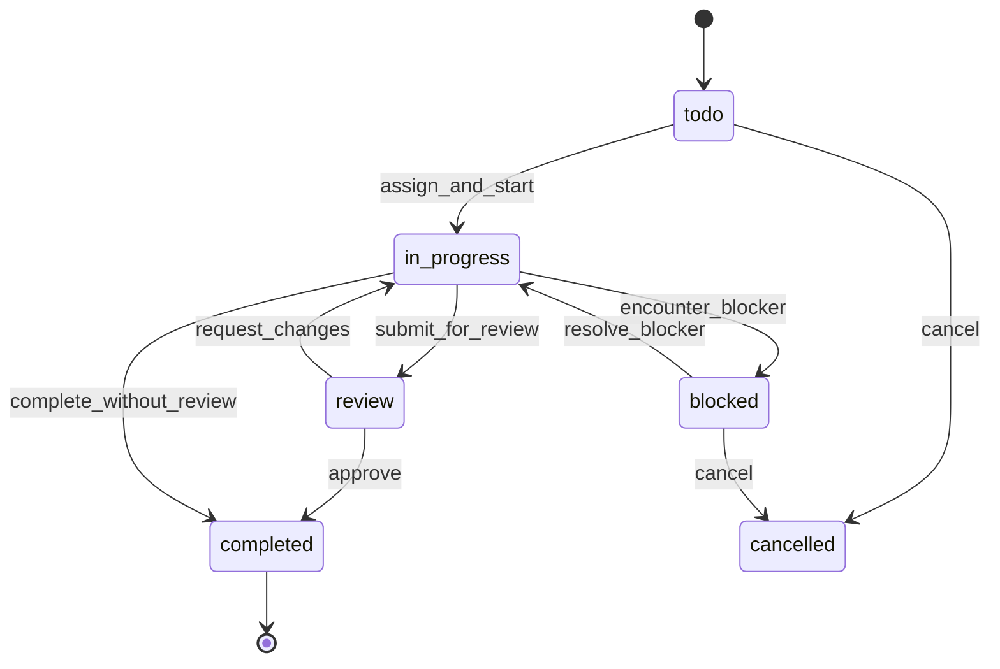
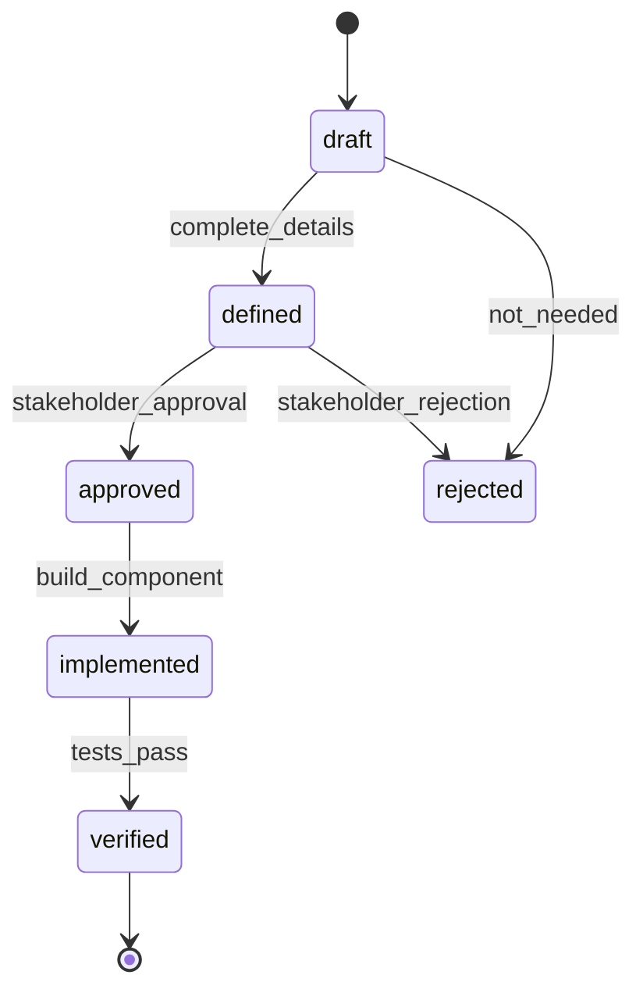

# Build Tracker Data Gateway Specification

**Purpose**: Comprehensive analysis and workflow design for Build Tracker domain tables in the `claude` schema.

**Date**: 2025-12-04
**Tables Analyzed**: `features`, `components`, `build_tasks`, `requirements`

---

## Table of Contents

1. [Executive Summary](#executive-summary)
2. [Table Analysis](#table-analysis)
   - [Features](#1-features-table)
   - [Components](#2-components-table)
   - [Build Tasks](#3-build_tasks-table)
   - [Requirements](#4-requirements-table)
3. [Cross-Table Business Rules](#cross-table-business-rules)
4. [Workflow Tool Specifications](#workflow-tool-specifications)
5. [Activity Logging Strategy](#activity-logging-strategy)
6. [Implementation Recommendations](#implementation-recommendations)

---

## Executive Summary

The Build Tracker domain manages the complete software development lifecycle from features to components to tasks. Key insights:

- **No Foreign Keys**: Tables lack FK constraints, requiring application-level validation
- **Inconsistent Status Values**: Mix of `complete` and `completed`, needs normalization
- **Manual Completion Tracking**: `completion_percentage` is set manually, not auto-calculated
- **Activity Logging**: `activity_feed` table exists for audit trail
- **Priority Range**: 1-10 scale (lower number = higher priority)

**Critical Issues to Address**:
1. Missing referential integrity (feature_id, component_id validation)
2. Status value standardization
3. Automated completion percentage calculation
4. Date field consistency (started_date vs started_at)

---

## Table Analysis

### 1. Features Table

**Schema**: `claude.features`

#### Column Definitions

| Column | Type | Nullable | Description |
|--------|------|----------|-------------|
| feature_id | uuid | NO | Primary key |
| feature_name | varchar | YES | Display name |
| feature_type | varchar | YES | Classification |
| description | text | YES | Detailed description |
| parent_feature_id | uuid | YES | Hierarchical parent (self-reference) |
| planned_date | timestamp | YES | When planning occurred |
| planned_by_identity_id | uuid | YES | Who planned it |
| priority | integer | YES | 1-10 (1=highest) |
| status | varchar | YES | Workflow state |
| completion_percentage | integer | YES | Manual progress (0-100) |
| started_date | timestamp | YES | When work began |
| completed_date | timestamp | YES | When completed |
| implemented_by_identity_id | uuid | YES | Who implemented |
| design_doc_path | text | YES | Path to design docs |
| implementation_notes | text | YES | Implementation details |
| created_at | timestamp | YES | Record creation |
| updated_at | timestamp | YES | Last update |
| project_id | uuid | YES | Parent project |

#### Valid Status Values

**Current Values** (found in data):
- `planned` - Feature defined but not started
- `in_progress` - Work has begun
- `completed` - Work finished

**Recommended Values**:
```sql
'not_started'  -- Initial state (replace 'planned')
'planned'      -- Design complete, ready to start
'in_progress'  -- Active development
'blocked'      -- Cannot proceed (should add blocked_reason field)
'on_hold'      -- Paused by decision
'completed'    -- All components done
'cancelled'    -- No longer needed
```

#### Valid Feature Types

**Current Values**:
- `system` - Infrastructure/backend (11 instances)
- `ui` - User interface (22 instances)
- `feature` - Standard feature (1 instance)
- `enhancement` - Improvement to existing (1 instance)
- `integration` - External system connection (1 instance)

**Recommended Values**:
```sql
'feature'      -- New capability
'enhancement'  -- Improvement to existing
'bug_fix'      -- Fixes defect
'refactoring'  -- Code improvement
'integration'  -- External system
'infrastructure' -- Backend/system (replace 'system')
'ui'           -- Frontend only
'api'          -- API endpoint/service
'data'         -- Data model/migration
```

#### Required Fields

**Minimum for Creation**:
- `feature_id` (UUID, auto-generated)
- `feature_name` (varchar, min 5 chars)
- `feature_type` (enum from valid values)
- `status` (default: 'not_started')
- `project_id` (uuid, must exist in projects table)
- `created_at` (timestamp, auto)

**Recommended Additions**:
- `description` (text, min 20 chars) - Required for 'planned' status
- `priority` (integer, 1-10, default: 5)

#### Business Rules

1. **Hierarchical Features**:
   - `parent_feature_id` must reference existing feature if not NULL
   - Prevent circular references (A→B→A)
   - Parent cannot be completed if children are incomplete

2. **Status Transitions**:
   ```
   not_started → planned (requires description)
   planned → in_progress (sets started_date)
   in_progress → blocked (requires blocked_reason field - ADD THIS)
   blocked → in_progress (requires unblock note)
   in_progress → completed (requires all components completed)
   any → cancelled (requires cancellation_reason field - ADD THIS)
   ```

3. **Completion Percentage**:
   - **Current**: Manual field (0-100)
   - **Recommended**: Auto-calculated from components
   ```sql
   completion_percentage = (completed_components / total_components) * 100
   ```
   - If no components exist, base on tasks
   - If neither exist, remain manual

4. **Date Fields**:
   - `started_date` must be NULL when status = 'not_started' or 'planned'
   - `started_date` required when status = 'in_progress', 'blocked', or 'completed'
   - `completed_date` only when status = 'completed'
   - `completed_date` >= `started_date`

5. **Assignment**:
   - `planned_by_identity_id` required when status != 'not_started'
   - `implemented_by_identity_id` required when status = 'in_progress' or 'completed'

#### Workflow Transitions



#### Quality Checks

```python
def validate_feature_create(data):
    checks = []

    # Name validation
    if not data.get('feature_name') or len(data['feature_name']) < 5:
        checks.append("feature_name must be at least 5 characters")

    # Type validation
    if data.get('feature_type') not in VALID_FEATURE_TYPES:
        checks.append(f"Invalid feature_type. Must be one of: {VALID_FEATURE_TYPES}")

    # Project validation
    if not data.get('project_id'):
        checks.append("project_id is required")
    elif not project_exists(data['project_id']):
        checks.append(f"project_id {data['project_id']} does not exist")

    # Parent validation
    if data.get('parent_feature_id'):
        if not feature_exists(data['parent_feature_id']):
            checks.append("parent_feature_id does not exist")
        if would_create_cycle(data['parent_feature_id'], data['feature_id']):
            checks.append("parent_feature_id would create circular reference")

    # Priority validation
    if data.get('priority') and not (1 <= data['priority'] <= 10):
        checks.append("priority must be between 1 and 10")

    return checks

def validate_feature_status_change(feature_id, new_status, reason=None):
    feature = get_feature(feature_id)
    current = feature['status']

    # Define valid transitions
    VALID_TRANSITIONS = {
        'not_started': ['planned', 'cancelled'],
        'planned': ['in_progress', 'cancelled'],
        'in_progress': ['blocked', 'completed', 'cancelled'],
        'blocked': ['in_progress', 'cancelled'],
        'completed': [],  # Terminal state
        'cancelled': []   # Terminal state
    }

    if new_status not in VALID_TRANSITIONS.get(current, []):
        raise ValidationError(
            f"Cannot transition from {current} to {new_status}"
        )

    # Status-specific validation
    if new_status == 'planned' and not feature.get('description'):
        raise ValidationError("description required for planned status")

    if new_status == 'in_progress' and not feature.get('implemented_by_identity_id'):
        raise ValidationError("implemented_by_identity_id required to start work")

    if new_status == 'completed':
        # Check all components are complete
        incomplete = get_incomplete_components(feature_id)
        if incomplete:
            raise ValidationError(
                f"{len(incomplete)} components not completed: {incomplete}"
            )

    if new_status in ['blocked', 'cancelled'] and not reason:
        raise ValidationError(f"reason required for {new_status} status")

    return True
```

---

### 2. Components Table

**Schema**: `claude.components`

#### Column Definitions

| Column | Type | Nullable | Description |
|--------|------|----------|-------------|
| component_id | uuid | NO | Primary key |
| feature_id | uuid | YES | Parent feature |
| component_name | varchar | YES | Display name |
| component_type | varchar | YES | Classification |
| file_path | text | YES | Source file location |
| planned_functions | text[] | YES | Expected functions |
| planned_dependencies | text[] | YES | Expected dependencies |
| status | varchar | YES | Workflow state |
| actual_functions | text[] | YES | Implemented functions |
| lines_of_code | integer | YES | LOC count |
| has_tests | boolean | YES | Test coverage exists |
| test_coverage_percentage | integer | YES | % covered (0-100) |
| has_documentation | boolean | YES | Docs exist |
| doc_path | text | YES | Documentation location |
| created_at | timestamp | YES | Record creation |
| updated_at | timestamp | YES | Last update |
| implemented_at | timestamp | YES | When implemented |

#### Valid Status Values

**Current Values** (found in data):
- `planned` - Designed but not built (22 instances)
- `complete` - Built (7 instances) **⚠️ Inconsistent**
- `completed` - Built (81 instances)

**Recommended Values** (standardize to `completed`):
```sql
'planned'      -- Designed, not started
'in_progress'  -- Being built
'completed'    -- Built and integrated
'tested'       -- Tests passing
'documented'   -- Documentation complete
'deprecated'   -- No longer used
```

#### Valid Component Types

**Current Values**:
- `component` - Generic (40 instances)
- `service` - Backend service (16 instances)
- `ui` - UI component (19 instances)
- `module` - Module (13 instances)
- `api` - API endpoint (10 instances)
- `dialog` - Dialog/modal (3 instances)
- `hook` - React hook (3 instances)
- `page` - Full page (2 instances)
- `layout` - Layout component (1 instance)
- `store` - State store (1 instance)
- `database` - DB schema (1 instance)
- `crud` - CRUD operations (1 instance)

**Recommended Values**:
```sql
-- Frontend
'ui_component'  -- Reusable UI (combine 'component' + 'ui')
'page'          -- Full page
'layout'        -- Layout wrapper
'dialog'        -- Modal/dialog
'hook'          -- React hook
'store'         -- State management

-- Backend
'api_endpoint'  -- REST/GraphQL endpoint (combine 'api')
'service'       -- Business logic service
'repository'    -- Data access layer
'middleware'    -- Request processing
'worker'        -- Background job
'database'      -- Schema/migration

-- Shared
'module'        -- Standalone module
'utility'       -- Helper functions
'config'        -- Configuration
'types'         -- TypeScript types
'test'          -- Test suite
```

#### Required Fields

**Minimum for Creation**:
- `component_id` (UUID, auto-generated)
- `feature_id` (UUID, must exist in features)
- `component_name` (varchar, min 3 chars)
- `component_type` (enum from valid values)
- `status` (default: 'planned')
- `created_at` (timestamp, auto)

**For Status='completed'**:
- `file_path` (text, must be valid file path)
- `actual_functions` (text[], at least one function)

#### Business Rules

1. **Feature Relationship**:
   - `feature_id` must reference existing feature
   - Component cannot be 'completed' if feature is 'not_started'
   - Component status change triggers feature completion % update

2. **Status Transitions**:
   ```
   planned → in_progress (start building)
   in_progress → completed (code complete, sets implemented_at)
   completed → tested (tests passing, requires has_tests=true)
   tested → documented (docs written, requires has_documentation=true)
   any → deprecated (mark as obsolete)
   ```

3. **Code Quality**:
   - `has_tests` should be true for status='tested'
   - `test_coverage_percentage` required if `has_tests=true`
   - `test_coverage_percentage` should be 0-100
   - Warn if coverage < 80% for critical components

4. **File Path Validation**:
   - `file_path` must be valid relative path when status='completed'
   - File should exist if `file_path` provided
   - Generate file path from component_name and type if not provided

5. **Function Tracking**:
   - `actual_functions` should match `planned_functions` when completed
   - Alert if actual differs significantly from planned
   - Empty `actual_functions` invalid for status='completed'

6. **Documentation**:
   - `has_documentation=true` requires `doc_path`
   - `doc_path` should point to valid markdown file
   - Warn if component is 'completed' but `has_documentation=false`

#### Workflow Transitions



#### Quality Checks

```python
def validate_component_create(data):
    checks = []

    # Name validation
    if not data.get('component_name') or len(data['component_name']) < 3:
        checks.append("component_name must be at least 3 characters")

    # Type validation
    if data.get('component_type') not in VALID_COMPONENT_TYPES:
        checks.append(f"Invalid component_type: {data.get('component_type')}")

    # Feature validation
    if not data.get('feature_id'):
        checks.append("feature_id is required")
    else:
        feature = get_feature(data['feature_id'])
        if not feature:
            checks.append(f"feature_id {data['feature_id']} does not exist")
        elif feature['status'] == 'cancelled':
            checks.append("Cannot add component to cancelled feature")

    return checks

def validate_component_completion(component_id):
    component = get_component(component_id)
    checks = []

    # File path required
    if not component.get('file_path'):
        checks.append("file_path required for completion")

    # Functions required
    if not component.get('actual_functions') or len(component['actual_functions']) == 0:
        checks.append("actual_functions required (at least one)")

    # Compare with planned
    planned = set(component.get('planned_functions') or [])
    actual = set(component.get('actual_functions') or [])

    missing = planned - actual
    if missing:
        checks.append(f"Missing planned functions: {missing}")

    extra = actual - planned
    if extra:
        checks.append(f"WARNING: Extra functions not planned: {extra}")

    # Test coverage check
    if not component.get('has_tests'):
        checks.append("WARNING: No tests for this component")
    elif component.get('test_coverage_percentage', 0) < 80:
        checks.append(
            f"WARNING: Low test coverage: {component['test_coverage_percentage']}%"
        )

    return checks
```

---

### 3. Build Tasks Table

**Schema**: `claude.build_tasks`

#### Column Definitions

| Column | Type | Nullable | Description |
|--------|------|----------|-------------|
| task_id | uuid | NO | Primary key |
| component_id | uuid | YES | Parent component |
| feature_id | uuid | YES | Parent feature |
| task_name | varchar | YES | Display name |
| task_description | text | YES | Detailed description |
| task_type | varchar | YES | Classification |
| status | varchar | YES | Workflow state |
| priority | integer | YES | 1-10 (1=highest) |
| assigned_to_identity_id | uuid | YES | Who's working on it |
| estimated_hours | numeric | YES | Planned effort |
| actual_hours | numeric | YES | Actual effort |
| started_at | timestamp | YES | When work began |
| completed_at | timestamp | YES | When finished |
| blocked_reason | text | YES | Why blocked |
| blocked_by_task_id | uuid | YES | Dependency blocking |
| created_at | timestamp | YES | Record creation |
| updated_at | timestamp | YES | Last update |

#### Valid Status Values

**Current Values** (found in data):
- `todo` - Not started (89 instances)
- `completed` - Finished (60 instances)

**Recommended Values**:
```sql
'todo'         -- Not started (keep existing)
'in_progress'  -- Being worked on
'blocked'      -- Cannot proceed
'review'       -- Ready for review
'completed'    -- Done (keep existing)
'cancelled'    -- No longer needed
```

#### Valid Task Types

**Current Values**:
- `code` - Coding task (139 instances)
- `test` - Testing task (10 instances)

**Recommended Values**:
```sql
'code'         -- Write code
'test'         -- Write tests
'review'       -- Code review
'design'       -- Design/architecture
'documentation' -- Write docs
'research'     -- Investigation
'bug_fix'      -- Fix defect
'refactor'     -- Improve code
'deployment'   -- Deploy/release
'meeting'      -- Discussion/planning
```

#### Required Fields

**Minimum for Creation**:
- `task_id` (UUID, auto-generated)
- `task_name` (varchar, min 5 chars)
- `task_description` (text, min 10 chars)
- `task_type` (enum from valid values)
- `status` (default: 'todo')
- `created_at` (timestamp, auto)

**MUST Have One**:
- `component_id` OR `feature_id` (at least one required)

**For Status='in_progress'**:
- `assigned_to_identity_id` (UUID, must exist)
- `started_at` (timestamp, auto-set)

**For Status='completed'**:
- `completed_at` (timestamp, auto-set)
- `actual_hours` (numeric, > 0)

#### Business Rules

1. **Parent Relationship**:
   - Must have `component_id` OR `feature_id` (one is required)
   - If both provided, component must belong to that feature
   - Task cannot be 'completed' if parent is 'todo'/'not_started'

2. **Status Transitions**:
   ```
   todo → in_progress (requires assignment)
   in_progress → blocked (requires blocked_reason)
   blocked → in_progress (requires resolution note)
   in_progress → review (requires completion)
   review → in_progress (if changes requested)
   review → completed (if approved)
   in_progress → completed (if no review needed)
   any → cancelled (requires reason)
   ```

3. **Blocking**:
   - If status='blocked' and `blocked_by_task_id` provided, that task must exist
   - Cannot block self (task_id != blocked_by_task_id)
   - Cannot complete if blocking other incomplete tasks
   - Circular blocking detection (A blocks B blocks C blocks A)

4. **Time Tracking**:
   - `actual_hours` only when status='completed'
   - `actual_hours` should be > 0
   - Warn if `actual_hours` > 2x `estimated_hours` (estimate accuracy)
   - `completed_at` >= `started_at`
   - Calculate velocity: `estimated_hours` / `actual_hours`

5. **Assignment**:
   - `assigned_to_identity_id` required for status='in_progress', 'review', 'completed'
   - Can reassign tasks in 'todo' or 'blocked' status
   - Cannot unassign task in 'in_progress'

6. **Priority**:
   - Range: 1-10 (1=highest priority)
   - Default: 5 (medium)
   - Tasks with priority 1-3 should be started within 24 hours

#### Workflow Transitions



#### Quality Checks

```python
def validate_task_create(data):
    checks = []

    # Name validation
    if not data.get('task_name') or len(data['task_name']) < 5:
        checks.append("task_name must be at least 5 characters")

    # Description validation
    if not data.get('task_description') or len(data['task_description']) < 10:
        checks.append("task_description must be at least 10 characters")

    # Type validation
    if data.get('task_type') not in VALID_TASK_TYPES:
        checks.append(f"Invalid task_type: {data.get('task_type')}")

    # Parent validation (one required)
    if not data.get('component_id') and not data.get('feature_id'):
        checks.append("Either component_id or feature_id is required")

    # If both provided, validate relationship
    if data.get('component_id') and data.get('feature_id'):
        component = get_component(data['component_id'])
        if component['feature_id'] != data['feature_id']:
            checks.append("component_id does not belong to feature_id")

    # Priority validation
    if data.get('priority') and not (1 <= data['priority'] <= 10):
        checks.append("priority must be between 1 and 10")

    # Estimate validation
    if data.get('estimated_hours') and data['estimated_hours'] <= 0:
        checks.append("estimated_hours must be positive")

    return checks

def validate_task_start(task_id, identity_id):
    task = get_task(task_id)
    checks = []

    # Must be in todo status
    if task['status'] != 'todo':
        checks.append(f"Cannot start task with status: {task['status']}")

    # Identity must exist
    if not identity_exists(identity_id):
        checks.append(f"identity_id {identity_id} does not exist")

    # Check if blocked
    if task.get('blocked_by_task_id'):
        blocking_task = get_task(task['blocked_by_task_id'])
        if blocking_task['status'] != 'completed':
            checks.append(
                f"Task blocked by: {blocking_task['task_name']} "
                f"(status: {blocking_task['status']})"
            )

    return checks

def validate_task_completion(task_id, actual_hours):
    task = get_task(task_id)
    checks = []

    # Must be in in_progress or review
    if task['status'] not in ['in_progress', 'review']:
        checks.append(f"Cannot complete task with status: {task['status']}")

    # Actual hours required
    if not actual_hours or actual_hours <= 0:
        checks.append("actual_hours must be positive")

    # Check estimate accuracy
    if task.get('estimated_hours'):
        ratio = actual_hours / task['estimated_hours']
        if ratio > 2.0:
            checks.append(
                f"WARNING: Actual hours ({actual_hours}) is {ratio:.1f}x "
                f"the estimate ({task['estimated_hours']})"
            )

    return checks
```

---

### 4. Requirements Table

**Schema**: `claude.requirements`

#### Column Definitions

| Column | Type | Nullable | Description |
|--------|------|----------|-------------|
| requirement_id | uuid | NO | Primary key |
| feature_id | uuid | YES | Parent feature |
| requirement_name | varchar | YES | Display name |
| requirement_type | varchar | YES | Classification |
| description | text | YES | Detailed description |
| acceptance_criteria | text[] | YES | Success criteria |
| status | varchar | YES | Workflow state |
| priority | integer | YES | 1-10 (1=highest) |
| must_have | boolean | YES | Critical for feature |
| implemented_by_component_id | uuid | YES | Which component implements |
| verified_at | timestamp | YES | When verified |
| created_at | timestamp | YES | Record creation |
| updated_at | timestamp | YES | Last update |
| created_by_identity_id | uuid | YES | Who created |

#### Valid Status Values

**Current Values** (found in data):
- `defined` - Documented (109 instances)

**Recommended Values**:
```sql
'draft'        -- Being written
'defined'      -- Fully documented (keep existing)
'approved'     -- Stakeholder approved
'implemented'  -- Code complete
'verified'     -- Tests passing
'rejected'     -- Not needed
```

#### Valid Requirement Types

**Current Values**:
- `ui` - User interface (70 instances)
- `data` - Data/model (15 instances)
- `api` - API endpoint (10 instances)
- `functional` - Functional behavior (7 instances)
- `config` - Configuration (4 instances)
- `performance` - Performance goal (3 instances)

**Recommended Values**:
```sql
-- By Layer
'ui'           -- User interface
'api'          -- API/endpoint
'data'         -- Data model/storage
'integration'  -- External system

-- By Category
'functional'   -- What it does
'performance'  -- Speed/scale goal
'security'     -- Security requirement
'usability'    -- UX requirement
'accessibility' -- A11y requirement
'compliance'   -- Regulatory/legal
'config'       -- Configuration need
'deployment'   -- Deployment requirement
```

#### Required Fields

**Minimum for Creation**:
- `requirement_id` (UUID, auto-generated)
- `feature_id` (UUID, must exist in features)
- `requirement_name` (varchar, min 5 chars)
- `requirement_type` (enum from valid values)
- `description` (text, min 20 chars)
- `acceptance_criteria` (text[], at least one item)
- `status` (default: 'draft')
- `must_have` (boolean, default: false)
- `created_at` (timestamp, auto)
- `created_by_identity_id` (UUID, must exist)

**For Status='approved'**:
- `acceptance_criteria` must have at least 3 items
- `description` must be > 50 chars

**For Status='verified'**:
- `implemented_by_component_id` required
- `verified_at` timestamp required

#### Business Rules

1. **Feature Relationship**:
   - `feature_id` must reference existing feature
   - Cannot be 'verified' if feature is 'not_started' or 'planned'
   - All `must_have=true` requirements must be 'verified' before feature completion

2. **Status Transitions**:
   ```
   draft → defined (complete description + criteria)
   defined → approved (stakeholder approval)
   approved → implemented (component built)
   implemented → verified (tests pass, sets verified_at)
   draft → rejected (not needed)
   defined → rejected (stakeholder rejection)
   ```

3. **Acceptance Criteria**:
   - Must have at least 1 criterion
   - Each criterion should be testable
   - Criteria cannot be empty strings
   - Recommend format: "Given/When/Then" or "Should/Must"

4. **Component Implementation**:
   - `implemented_by_component_id` must exist
   - Component must be status='completed' or 'tested'
   - One component can implement multiple requirements
   - Track coverage: requirements per component

5. **Must-Have Requirements**:
   - `must_have=true` requirements cannot be 'rejected'
   - Feature cannot be 'completed' if any `must_have` requirement is not 'verified'
   - Warn if feature has zero `must_have` requirements

6. **Verification**:
   - `verified_at` only when status='verified'
   - Verification requires tests to pass
   - Link to test run ID (add `verified_by_test_run_id` field?)

#### Workflow Transitions



#### Quality Checks

```python
def validate_requirement_create(data):
    checks = []

    # Name validation
    if not data.get('requirement_name') or len(data['requirement_name']) < 5:
        checks.append("requirement_name must be at least 5 characters")

    # Description validation
    if not data.get('description') or len(data['description']) < 20:
        checks.append("description must be at least 20 characters")

    # Type validation
    if data.get('requirement_type') not in VALID_REQUIREMENT_TYPES:
        checks.append(f"Invalid requirement_type: {data.get('requirement_type')}")

    # Feature validation
    if not data.get('feature_id'):
        checks.append("feature_id is required")
    elif not feature_exists(data['feature_id']):
        checks.append(f"feature_id {data['feature_id']} does not exist")

    # Acceptance criteria validation
    if not data.get('acceptance_criteria') or len(data['acceptance_criteria']) == 0:
        checks.append("At least one acceptance criterion is required")
    else:
        for i, criterion in enumerate(data['acceptance_criteria']):
            if not criterion or len(criterion.strip()) == 0:
                checks.append(f"Acceptance criterion {i+1} is empty")

    # Creator validation
    if not data.get('created_by_identity_id'):
        checks.append("created_by_identity_id is required")

    return checks

def validate_requirement_approval(requirement_id):
    req = get_requirement(requirement_id)
    checks = []

    # Must be in 'defined' status
    if req['status'] != 'defined':
        checks.append(f"Cannot approve requirement with status: {req['status']}")

    # Description length check
    if len(req['description']) < 50:
        checks.append("Description too short for approval (min 50 chars)")

    # Acceptance criteria count
    if len(req.get('acceptance_criteria') or []) < 3:
        checks.append("Need at least 3 acceptance criteria for approval")

    # Check criteria quality
    for criterion in req.get('acceptance_criteria') or []:
        if not any(word in criterion.lower() for word in ['should', 'must', 'given', 'when', 'then']):
            checks.append(
                f"WARNING: Criterion may not be testable: '{criterion}'"
            )

    return checks

def validate_requirement_verification(requirement_id, component_id):
    req = get_requirement(requirement_id)
    checks = []

    # Must be in 'implemented' status
    if req['status'] != 'implemented':
        checks.append(f"Cannot verify requirement with status: {req['status']}")

    # Component must exist and be tested
    component = get_component(component_id)
    if not component:
        checks.append(f"component_id {component_id} does not exist")
    elif component['status'] not in ['completed', 'tested', 'documented']:
        checks.append(
            f"Component status is '{component['status']}', "
            f"must be completed/tested"
        )

    # Check test coverage
    if not component.get('has_tests'):
        checks.append("WARNING: Component has no tests")
    elif component.get('test_coverage_percentage', 0) < 80:
        checks.append(
            f"WARNING: Low test coverage for component: "
            f"{component['test_coverage_percentage']}%"
        )

    return checks
```

---

## Cross-Table Business Rules

### 1. Referential Integrity (Application-Level)

Since there are no foreign key constraints, implement these checks:

```python
def validate_references(entity_type, data):
    """Validate all foreign key references before insert/update"""

    if entity_type == 'component':
        if data.get('feature_id') and not feature_exists(data['feature_id']):
            raise ReferenceError(f"feature_id {data['feature_id']} not found")

    elif entity_type == 'build_task':
        if data.get('component_id') and not component_exists(data['component_id']):
            raise ReferenceError(f"component_id {data['component_id']} not found")
        if data.get('feature_id') and not feature_exists(data['feature_id']):
            raise ReferenceError(f"feature_id {data['feature_id']} not found")
        if data.get('blocked_by_task_id') and not task_exists(data['blocked_by_task_id']):
            raise ReferenceError(f"blocked_by_task_id {data['blocked_by_task_id']} not found")

    elif entity_type == 'requirement':
        if data.get('feature_id') and not feature_exists(data['feature_id']):
            raise ReferenceError(f"feature_id {data['feature_id']} not found")
        if data.get('implemented_by_component_id'):
            if not component_exists(data['implemented_by_component_id']):
                raise ReferenceError(
                    f"implemented_by_component_id {data['implemented_by_component_id']} not found"
                )
```

### 2. Hierarchical Consistency

```python
def validate_hierarchy(entity_type, data):
    """Ensure child status doesn't exceed parent status"""

    if entity_type == 'component':
        feature = get_feature(data['feature_id'])

        # Component can't be completed if feature is not started
        if data['status'] == 'completed' and feature['status'] in ['not_started', 'planned']:
            raise ValidationError(
                f"Cannot complete component when feature is '{feature['status']}'"
            )

    elif entity_type == 'build_task':
        if data.get('component_id'):
            component = get_component(data['component_id'])

            # Task can't be completed if component is planned
            if data['status'] == 'completed' and component['status'] == 'planned':
                raise ValidationError(
                    f"Cannot complete task when component is '{component['status']}'"
                )

    elif entity_type == 'requirement':
        feature = get_feature(data['feature_id'])

        # Requirement can't be verified if feature is not started
        if data['status'] == 'verified' and feature['status'] in ['not_started', 'planned']:
            raise ValidationError(
                f"Cannot verify requirement when feature is '{feature['status']}'"
            )
```

### 3. Completion Percentage Calculation

```python
def calculate_feature_completion(feature_id):
    """Auto-calculate feature completion from child entities"""

    # Get all components for feature
    components = get_components_by_feature(feature_id)

    if components:
        # Calculate from components
        total_components = len(components)
        completed_components = sum(
            1 for c in components
            if c['status'] in ['completed', 'tested', 'documented']
        )
        completion = int((completed_components / total_components) * 100)
    else:
        # Fallback to tasks if no components
        tasks = get_tasks_by_feature(feature_id)
        if tasks:
            total_tasks = len(tasks)
            completed_tasks = sum(1 for t in tasks if t['status'] == 'completed')
            completion = int((completed_tasks / total_tasks) * 100)
        else:
            # No components or tasks, keep manual value
            return None

    # Update feature
    update_feature(feature_id, {'completion_percentage': completion})
    return completion

def trigger_completion_update(entity_type, entity_id, old_status, new_status):
    """Trigger completion recalculation when child status changes"""

    if entity_type == 'component' and old_status != new_status:
        component = get_component(entity_id)
        calculate_feature_completion(component['feature_id'])

    elif entity_type == 'build_task' and old_status != new_status:
        task = get_task(entity_id)
        if task.get('feature_id'):
            calculate_feature_completion(task['feature_id'])
```

### 4. Dependency Validation

```python
def validate_dependencies(task_id):
    """Check if task dependencies are satisfied"""

    task = get_task(task_id)

    # Check blocked_by_task_id
    if task.get('blocked_by_task_id'):
        blocking_task = get_task(task['blocked_by_task_id'])

        if blocking_task['status'] != 'completed':
            return False, f"Blocked by task: {blocking_task['task_name']}"

    # Check circular dependencies
    visited = set()
    current = task_id

    while current:
        if current in visited:
            return False, "Circular dependency detected"

        visited.add(current)
        t = get_task(current)
        current = t.get('blocked_by_task_id')

    return True, None

def get_ready_tasks(feature_id=None, component_id=None):
    """Get tasks that are unblocked and ready to start"""

    filters = {'status': 'todo'}
    if feature_id:
        filters['feature_id'] = feature_id
    if component_id:
        filters['component_id'] = component_id

    tasks = get_tasks(filters)
    ready = []

    for task in tasks:
        is_ready, _ = validate_dependencies(task['task_id'])
        if is_ready:
            ready.append(task)

    # Sort by priority
    return sorted(ready, key=lambda t: t.get('priority', 5))
```

### 5. Feature Completion Gating

```python
def can_complete_feature(feature_id):
    """Check if all requirements are met for feature completion"""

    checks = []

    # Check components
    components = get_components_by_feature(feature_id)
    incomplete_components = [
        c for c in components
        if c['status'] not in ['completed', 'tested', 'documented']
    ]
    if incomplete_components:
        checks.append(
            f"{len(incomplete_components)} components not completed: "
            f"{[c['component_name'] for c in incomplete_components]}"
        )

    # Check must-have requirements
    requirements = get_requirements_by_feature(feature_id)
    must_have_requirements = [r for r in requirements if r.get('must_have')]
    unverified_must_haves = [
        r for r in must_have_requirements
        if r['status'] != 'verified'
    ]
    if unverified_must_haves:
        checks.append(
            f"{len(unverified_must_haves)} must-have requirements not verified: "
            f"{[r['requirement_name'] for r in unverified_must_haves]}"
        )

    # Check tasks
    tasks = get_tasks_by_feature(feature_id)
    incomplete_tasks = [t for t in tasks if t['status'] != 'completed']
    if incomplete_tasks:
        checks.append(
            f"{len(incomplete_tasks)} tasks not completed: "
            f"{[t['task_name'] for t in incomplete_tasks]}"
        )

    return len(checks) == 0, checks
```

---

## Workflow Tool Specifications

### Tool: `add_feature`

**Purpose**: Create a new feature with validation and activity logging

**Parameters**:
```python
def add_feature(
    feature_name: str,
    feature_type: str,
    description: str,
    project_id: str,
    priority: int = 5,
    parent_feature_id: str = None,
    planned_by_identity_id: str = None,
    design_doc_path: str = None
) -> dict:
```

**Validation Steps**:
1. Validate `feature_name` (min 5 chars, not duplicate in project)
2. Validate `feature_type` (must be in VALID_FEATURE_TYPES)
3. Validate `project_id` exists
4. Validate `priority` (1-10)
5. If `parent_feature_id` provided:
   - Validate exists
   - Check for circular reference
6. Validate `description` (min 20 chars if moving to 'planned')

**Side Effects**:
1. Generate UUID for `feature_id`
2. Set `status='not_started'`
3. Set `completion_percentage=0`
4. Set `created_at=now()`
5. Set `updated_at=now()`
6. Insert into `features` table
7. Log to `activity_feed`:
   ```python
   {
       'source_type': 'feature',
       'source_id': feature_id,
       'activity_type': 'created',
       'title': f'Feature created: {feature_name}',
       'summary': f'New {feature_type} feature added to project',
       'project_name': get_project_name(project_id),
       'actor': get_identity_name(planned_by_identity_id),
       'severity': 'info'
   }
   ```

**Return**:
```python
{
    'feature_id': 'uuid',
    'feature_name': 'str',
    'status': 'not_started',
    'completion_percentage': 0,
    'created_at': 'timestamp',
    'validation_warnings': ['list of non-critical issues']
}
```

---

### Tool: `update_feature_status`

**Purpose**: Change feature status with workflow validation

**Parameters**:
```python
def update_feature_status(
    feature_id: str,
    new_status: str,
    reason: str = None,  # Required for 'blocked', 'cancelled'
    implemented_by_identity_id: str = None  # Required for 'in_progress'
) -> dict:
```

**Validation Steps**:
1. Validate `feature_id` exists
2. Validate `new_status` in VALID_FEATURE_STATUSES
3. Check valid transition from current status
4. Status-specific validation:
   - `planned`: requires `description` (min 20 chars)
   - `in_progress`: requires `implemented_by_identity_id`
   - `blocked`: requires `reason`
   - `completed`: check all components/requirements complete
   - `cancelled`: requires `reason`

**Side Effects**:
1. Update `status` field
2. Update timestamps:
   - `in_progress`: set `started_date=now()`
   - `completed`: set `completed_date=now()`
3. Update `updated_at=now()`
4. Recalculate `completion_percentage` if completing
5. Log to `activity_feed`:
   ```python
   {
       'source_type': 'feature',
       'source_id': feature_id,
       'activity_type': 'status_changed',
       'title': f'Feature {old_status} → {new_status}',
       'summary': reason or f'Feature moved to {new_status}',
       'severity': 'info' if new_status == 'completed' else 'warning'
   }
   ```
6. If `completed`, trigger notifications to stakeholders

**Return**:
```python
{
    'feature_id': 'uuid',
    'old_status': 'str',
    'new_status': 'str',
    'completion_percentage': 'int',
    'updated_at': 'timestamp',
    'validation_errors': [],
    'validation_warnings': []
}
```

---

### Tool: `add_component`

**Purpose**: Add component to a feature

**Parameters**:
```python
def add_component(
    feature_id: str,
    component_name: str,
    component_type: str,
    planned_functions: list[str] = None,
    planned_dependencies: list[str] = None,
    file_path: str = None
) -> dict:
```

**Validation Steps**:
1. Validate `feature_id` exists
2. Validate `component_name` (min 3 chars, unique within feature)
3. Validate `component_type` in VALID_COMPONENT_TYPES
4. Auto-generate `file_path` if not provided (based on type and name)
5. Validate `planned_functions` (at least one recommended)

**Side Effects**:
1. Generate UUID for `component_id`
2. Set `status='planned'`
3. Set `has_tests=false`, `has_documentation=false`
4. Set `created_at=now()`, `updated_at=now()`
5. Insert into `components` table
6. Update feature's completion percentage
7. Log to `activity_feed`:
   ```python
   {
       'source_type': 'component',
       'source_id': component_id,
       'activity_type': 'created',
       'title': f'Component planned: {component_name}',
       'summary': f'{component_type} component added to feature',
       'severity': 'info'
   }
   ```

**Return**:
```python
{
    'component_id': 'uuid',
    'component_name': 'str',
    'status': 'planned',
    'file_path': 'str',
    'validation_warnings': []
}
```

---

### Tool: `complete_component`

**Purpose**: Mark component as completed with validation

**Parameters**:
```python
def complete_component(
    component_id: str,
    actual_functions: list[str],
    file_path: str = None,
    lines_of_code: int = None,
    has_tests: bool = False,
    test_coverage_percentage: int = 0
) -> dict:
```

**Validation Steps**:
1. Validate `component_id` exists
2. Validate current status is 'in_progress'
3. Validate `actual_functions` not empty
4. Compare with `planned_functions`, warn on differences
5. Validate `file_path` (must be provided or already set)
6. Warn if `has_tests=false`
7. Warn if `test_coverage_percentage < 80`

**Side Effects**:
1. Update `status='completed'`
2. Update `actual_functions`, `file_path`, `lines_of_code`
3. Update `has_tests`, `test_coverage_percentage`
4. Set `implemented_at=now()`, `updated_at=now()`
5. Recalculate feature completion percentage
6. Check if feature can be completed
7. Log to `activity_feed`:
   ```python
   {
       'source_type': 'component',
       'source_id': component_id,
       'activity_type': 'completed',
       'title': f'Component completed: {component_name}',
       'summary': f'{lines_of_code} LOC, {test_coverage_percentage}% coverage',
       'severity': 'info'
   }
   ```

**Return**:
```python
{
    'component_id': 'uuid',
    'status': 'completed',
    'implemented_at': 'timestamp',
    'feature_completion_percentage': 'int',
    'validation_warnings': [],
    'feature_ready_to_complete': 'bool'
}
```

---

### Tool: `add_task`

**Purpose**: Create a build task

**Parameters**:
```python
def add_task(
    task_name: str,
    task_description: str,
    task_type: str,
    component_id: str = None,
    feature_id: str = None,
    priority: int = 5,
    estimated_hours: float = None,
    assigned_to_identity_id: str = None,
    blocked_by_task_id: str = None
) -> dict:
```

**Validation Steps**:
1. Validate `task_name` (min 5 chars)
2. Validate `task_description` (min 10 chars)
3. Validate `task_type` in VALID_TASK_TYPES
4. Validate `component_id` OR `feature_id` (at least one)
5. If both provided, validate component belongs to feature
6. Validate `priority` (1-10)
7. Validate `estimated_hours > 0` if provided
8. If `blocked_by_task_id`, validate exists and not circular

**Side Effects**:
1. Generate UUID for `task_id`
2. Set `status='todo'`
3. Set `created_at=now()`, `updated_at=now()`
4. Insert into `build_tasks` table
5. If `assigned_to_identity_id`, notify assignee
6. Log to `activity_feed`:
   ```python
   {
       'source_type': 'build_task',
       'source_id': task_id,
       'activity_type': 'created',
       'title': f'Task created: {task_name}',
       'summary': f'{task_type} task (priority {priority})',
       'actor': get_identity_name(assigned_to_identity_id),
       'severity': 'info'
   }
   ```

**Return**:
```python
{
    'task_id': 'uuid',
    'task_name': 'str',
    'status': 'todo',
    'priority': 'int',
    'is_blocked': 'bool',
    'validation_warnings': []
}
```

---

### Tool: `start_task`

**Purpose**: Begin work on a task

**Parameters**:
```python
def start_task(
    task_id: str,
    identity_id: str
) -> dict:
```

**Validation Steps**:
1. Validate `task_id` exists
2. Validate current status is 'todo'
3. Validate `identity_id` exists
4. Check dependencies (not blocked by incomplete tasks)
5. Warn if identity has > 5 active tasks

**Side Effects**:
1. Update `status='in_progress'`
2. Update `assigned_to_identity_id=identity_id`
3. Set `started_at=now()`, `updated_at=now()`
4. Log to `activity_feed`:
   ```python
   {
       'source_type': 'build_task',
       'source_id': task_id,
       'activity_type': 'started',
       'title': f'Task started: {task_name}',
       'actor': get_identity_name(identity_id),
       'severity': 'info'
   }
   ```
5. Send notification to assignee

**Return**:
```python
{
    'task_id': 'uuid',
    'status': 'in_progress',
    'started_at': 'timestamp',
    'assigned_to': 'str',
    'active_tasks_count': 'int',
    'validation_warnings': []
}
```

---

### Tool: `complete_task`

**Purpose**: Mark task as completed

**Parameters**:
```python
def complete_task(
    task_id: str,
    actual_hours: float,
    completion_notes: str = None
) -> dict:
```

**Validation Steps**:
1. Validate `task_id` exists
2. Validate current status is 'in_progress' or 'review'
3. Validate `actual_hours > 0`
4. Warn if `actual_hours` significantly differs from estimate
5. Check if completing this task unblocks others

**Side Effects**:
1. Update `status='completed'`
2. Update `actual_hours`
3. Set `completed_at=now()`, `updated_at=now()`
4. Recalculate feature/component completion
5. Unblock dependent tasks
6. Calculate velocity metric
7. Log to `activity_feed`:
   ```python
   {
       'source_type': 'build_task',
       'source_id': task_id,
       'activity_type': 'completed',
       'title': f'Task completed: {task_name}',
       'summary': f'Completed in {actual_hours}h (est: {estimated_hours}h)',
       'actor': get_identity_name(assigned_to_identity_id),
       'severity': 'info'
   }
   ```
8. Notify dependent task assignees

**Return**:
```python
{
    'task_id': 'uuid',
    'status': 'completed',
    'completed_at': 'timestamp',
    'actual_hours': 'float',
    'estimate_accuracy': 'float',  # actual / estimated
    'unblocked_tasks': ['list of task_ids'],
    'validation_warnings': []
}
```

---

### Tool: `add_requirement`

**Purpose**: Define a requirement for a feature

**Parameters**:
```python
def add_requirement(
    feature_id: str,
    requirement_name: str,
    requirement_type: str,
    description: str,
    acceptance_criteria: list[str],
    priority: int = 5,
    must_have: bool = False,
    created_by_identity_id: str = None
) -> dict:
```

**Validation Steps**:
1. Validate `feature_id` exists
2. Validate `requirement_name` (min 5 chars)
3. Validate `requirement_type` in VALID_REQUIREMENT_TYPES
4. Validate `description` (min 20 chars)
5. Validate `acceptance_criteria` has at least 1 item
6. Validate each criterion is not empty
7. Warn if criteria not in Given/When/Then format

**Side Effects**:
1. Generate UUID for `requirement_id`
2. Set `status='draft'`
3. Set `created_at=now()`, `updated_at=now()`
4. Insert into `requirements` table
5. Log to `activity_feed`:
   ```python
   {
       'source_type': 'requirement',
       'source_id': requirement_id,
       'activity_type': 'created',
       'title': f'Requirement defined: {requirement_name}',
       'summary': f'{requirement_type} requirement (must_have={must_have})',
       'actor': get_identity_name(created_by_identity_id),
       'severity': 'info'
   }
   ```

**Return**:
```python
{
    'requirement_id': 'uuid',
    'requirement_name': 'str',
    'status': 'draft',
    'must_have': 'bool',
    'criteria_count': 'int',
    'validation_warnings': []
}
```

---

### Tool: `verify_requirement`

**Purpose**: Mark requirement as verified

**Parameters**:
```python
def verify_requirement(
    requirement_id: str,
    component_id: str,
    test_results: str = None
) -> dict:
```

**Validation Steps**:
1. Validate `requirement_id` exists
2. Validate current status is 'implemented'
3. Validate `component_id` exists
4. Validate component status is 'completed' or 'tested'
5. Validate component `has_tests=true`
6. Warn if test coverage < 80%

**Side Effects**:
1. Update `status='verified'`
2. Update `implemented_by_component_id=component_id`
3. Set `verified_at=now()`, `updated_at=now()`
4. Check if all must-have requirements verified
5. Log to `activity_feed`:
   ```python
   {
       'source_type': 'requirement',
       'source_id': requirement_id,
       'activity_type': 'verified',
       'title': f'Requirement verified: {requirement_name}',
       'summary': f'Implemented by {component_name}',
       'severity': 'info'
   }
   ```
6. If all must-haves verified, notify feature owner

**Return**:
```python
{
    'requirement_id': 'uuid',
    'status': 'verified',
    'verified_at': 'timestamp',
    'implemented_by': 'str',
    'all_must_haves_verified': 'bool',
    'validation_warnings': []
}
```

---

## Activity Logging Strategy

### Activity Feed Table Structure

**Table**: `claude.activity_feed`

**Columns**:
- `id` (uuid, PK)
- `source_type` (varchar, NOT NULL) - 'feature', 'component', 'build_task', 'requirement'
- `source_id` (uuid) - Reference to entity
- `actor` (varchar) - Who performed action
- `activity_type` (varchar, NOT NULL) - 'created', 'updated', 'status_changed', 'completed', etc.
- `title` (varchar, NOT NULL) - Short summary
- `summary` (text) - Detailed description
- `project_name` (varchar) - For filtering
- `severity` (varchar) - 'info', 'warning', 'error', 'success'
- `created_at` (timestamp, default: now())

### Activity Types

**Standard Activities**:
```python
ACTIVITY_TYPES = {
    'created': 'Entity created',
    'updated': 'Entity updated',
    'status_changed': 'Status transition',
    'completed': 'Work completed',
    'started': 'Work started',
    'assigned': 'Task assigned',
    'blocked': 'Work blocked',
    'unblocked': 'Blocker resolved',
    'verified': 'Requirement verified',
    'cancelled': 'Work cancelled',
    'deleted': 'Entity deleted'
}
```

### Logging Function

```python
def log_activity(
    source_type: str,
    source_id: str,
    activity_type: str,
    title: str,
    summary: str = None,
    actor: str = None,
    project_name: str = None,
    severity: str = 'info'
):
    """
    Log activity to activity_feed table

    Args:
        source_type: 'feature', 'component', 'build_task', 'requirement'
        source_id: UUID of entity
        activity_type: Type of activity (from ACTIVITY_TYPES)
        title: Short summary (max 255 chars)
        summary: Detailed description
        actor: Identity who performed action
        project_name: Project context
        severity: 'info', 'warning', 'error', 'success'
    """
    activity = {
        'id': generate_uuid(),
        'source_type': source_type,
        'source_id': source_id,
        'actor': actor,
        'activity_type': activity_type,
        'title': title[:255],  # Truncate if needed
        'summary': summary,
        'project_name': project_name,
        'severity': severity,
        'created_at': now()
    }

    insert_into_activity_feed(activity)

    # Optional: Trigger notifications for high-severity
    if severity in ['error', 'warning']:
        send_notification(activity)
```

### Indexing Strategy

```sql
-- Already exists
CREATE INDEX idx_activity_feed_time ON claude.activity_feed (created_at DESC);
CREATE INDEX idx_activity_feed_project ON claude.activity_feed (project_name, created_at DESC);

-- Recommended additions
CREATE INDEX idx_activity_feed_source ON claude.activity_feed (source_type, source_id);
CREATE INDEX idx_activity_feed_actor ON claude.activity_feed (actor, created_at DESC);
CREATE INDEX idx_activity_feed_type ON claude.activity_feed (activity_type, created_at DESC);
```

### Query Examples

```sql
-- Get recent activities for a feature
SELECT
    activity_type,
    title,
    summary,
    actor,
    created_at
FROM claude.activity_feed
WHERE source_type = 'feature'
  AND source_id = '...'
ORDER BY created_at DESC
LIMIT 50;

-- Get all activities for a project today
SELECT
    source_type,
    activity_type,
    title,
    actor,
    created_at
FROM claude.activity_feed
WHERE project_name = 'my-project'
  AND created_at >= CURRENT_DATE
ORDER BY created_at DESC;

-- Get error/warning activities
SELECT
    source_type,
    title,
    summary,
    severity,
    created_at
FROM claude.activity_feed
WHERE severity IN ('error', 'warning')
  AND created_at >= NOW() - INTERVAL '7 days'
ORDER BY created_at DESC;
```

---

## Implementation Recommendations

### 1. Database Schema Improvements

**Priority 1 - Critical**:

```sql
-- Add foreign key constraints (enable referential integrity)
ALTER TABLE claude.components
ADD CONSTRAINT fk_components_feature
FOREIGN KEY (feature_id) REFERENCES claude.features(feature_id)
ON DELETE CASCADE;

ALTER TABLE claude.build_tasks
ADD CONSTRAINT fk_tasks_component
FOREIGN KEY (component_id) REFERENCES claude.components(component_id)
ON DELETE SET NULL;

ALTER TABLE claude.build_tasks
ADD CONSTRAINT fk_tasks_feature
FOREIGN KEY (feature_id) REFERENCES claude.features(feature_id)
ON DELETE CASCADE;

ALTER TABLE claude.requirements
ADD CONSTRAINT fk_requirements_feature
FOREIGN KEY (feature_id) REFERENCES claude.features(feature_id)
ON DELETE CASCADE;

-- Standardize status values (fix 'complete' vs 'completed')
UPDATE claude.components SET status = 'completed' WHERE status = 'complete';

-- Add missing fields
ALTER TABLE claude.features
ADD COLUMN blocked_reason TEXT,
ADD COLUMN cancellation_reason TEXT;

ALTER TABLE claude.build_tasks
ADD COLUMN completion_notes TEXT;

ALTER TABLE claude.requirements
ADD COLUMN verified_by_test_run_id UUID;
```

**Priority 2 - Important**:

```sql
-- Add check constraints for enums
ALTER TABLE claude.features
ADD CONSTRAINT chk_feature_status
CHECK (status IN ('not_started', 'planned', 'in_progress', 'blocked', 'on_hold', 'completed', 'cancelled'));

ALTER TABLE claude.features
ADD CONSTRAINT chk_feature_type
CHECK (feature_type IN ('feature', 'enhancement', 'bug_fix', 'refactoring', 'integration', 'infrastructure', 'ui', 'api', 'data'));

ALTER TABLE claude.components
ADD CONSTRAINT chk_component_status
CHECK (status IN ('planned', 'in_progress', 'completed', 'tested', 'documented', 'deprecated'));

ALTER TABLE claude.build_tasks
ADD CONSTRAINT chk_task_status
CHECK (status IN ('todo', 'in_progress', 'blocked', 'review', 'completed', 'cancelled'));

-- Add check for priority range
ALTER TABLE claude.features
ADD CONSTRAINT chk_feature_priority
CHECK (priority >= 1 AND priority <= 10);

ALTER TABLE claude.build_tasks
ADD CONSTRAINT chk_task_priority
CHECK (priority >= 1 AND priority <= 10);

-- Add check for completion percentage
ALTER TABLE claude.features
ADD CONSTRAINT chk_completion_percentage
CHECK (completion_percentage >= 0 AND completion_percentage <= 100);
```

**Priority 3 - Nice to Have**:

```sql
-- Add indexes for common queries
CREATE INDEX idx_features_status ON claude.features(status);
CREATE INDEX idx_features_project ON claude.features(project_id, status);
CREATE INDEX idx_components_feature ON claude.components(feature_id, status);
CREATE INDEX idx_tasks_component ON claude.build_tasks(component_id, status);
CREATE INDEX idx_tasks_feature ON claude.build_tasks(feature_id, status);
CREATE INDEX idx_tasks_assigned ON claude.build_tasks(assigned_to_identity_id, status);
CREATE INDEX idx_requirements_feature ON claude.requirements(feature_id, status);

-- Add NOT NULL constraints for required fields
ALTER TABLE claude.features
ALTER COLUMN feature_name SET NOT NULL,
ALTER COLUMN feature_type SET NOT NULL,
ALTER COLUMN status SET NOT NULL,
ALTER COLUMN project_id SET NOT NULL;

ALTER TABLE claude.components
ALTER COLUMN component_name SET NOT NULL,
ALTER COLUMN component_type SET NOT NULL,
ALTER COLUMN feature_id SET NOT NULL,
ALTER COLUMN status SET NOT NULL;

ALTER TABLE claude.build_tasks
ALTER COLUMN task_name SET NOT NULL,
ALTER COLUMN task_description SET NOT NULL,
ALTER COLUMN task_type SET NOT NULL,
ALTER COLUMN status SET NOT NULL;
```

### 2. Application Layer Patterns

**Validation Layer**:
```python
# validators.py
class BuildTrackerValidator:
    """Centralized validation for Build Tracker domain"""

    def validate_feature(self, data, operation='create'):
        errors = []
        warnings = []

        # Run validation checks
        if operation == 'create':
            errors.extend(self._validate_feature_create(data))
        elif operation == 'update':
            errors.extend(self._validate_feature_update(data))

        return {'errors': errors, 'warnings': warnings}

    def validate_status_transition(self, entity_type, current, new):
        # Check valid transitions
        pass
```

**Service Layer**:
```python
# services.py
class FeatureService:
    """Business logic for features"""

    def __init__(self, db, validator, activity_logger):
        self.db = db
        self.validator = validator
        self.activity = activity_logger

    def create_feature(self, data):
        # Validate
        validation = self.validator.validate_feature(data, 'create')
        if validation['errors']:
            raise ValidationError(validation['errors'])

        # Generate ID
        data['feature_id'] = generate_uuid()
        data['status'] = 'not_started'
        data['completion_percentage'] = 0
        data['created_at'] = now()
        data['updated_at'] = now()

        # Insert
        feature = self.db.insert('features', data)

        # Log activity
        self.activity.log(
            source_type='feature',
            source_id=feature['feature_id'],
            activity_type='created',
            title=f"Feature created: {feature['feature_name']}",
            summary=f"New {feature['feature_type']} feature",
            project_name=get_project_name(feature['project_id'])
        )

        return feature
```

**Data Access Layer**:
```python
# repositories.py
class FeatureRepository:
    """Database access for features"""

    def __init__(self, db):
        self.db = db

    def get_by_id(self, feature_id):
        return self.db.query_one(
            "SELECT * FROM claude.features WHERE feature_id = %s",
            [feature_id]
        )

    def get_with_children(self, feature_id):
        """Get feature with all components, tasks, requirements"""
        return self.db.query_one("""
            SELECT
                f.*,
                json_agg(DISTINCT c.*) FILTER (WHERE c.component_id IS NOT NULL) as components,
                json_agg(DISTINCT t.*) FILTER (WHERE t.task_id IS NOT NULL) as tasks,
                json_agg(DISTINCT r.*) FILTER (WHERE r.requirement_id IS NOT NULL) as requirements
            FROM claude.features f
            LEFT JOIN claude.components c ON c.feature_id = f.feature_id
            LEFT JOIN claude.build_tasks t ON t.feature_id = f.feature_id
            LEFT JOIN claude.requirements r ON r.feature_id = f.feature_id
            WHERE f.feature_id = %s
            GROUP BY f.feature_id
        """, [feature_id])
```

### 3. API Design

**RESTful Endpoints**:

```
POST   /api/features                    - Create feature
GET    /api/features/:id                - Get feature
PUT    /api/features/:id                - Update feature
DELETE /api/features/:id                - Delete feature
PATCH  /api/features/:id/status         - Change status
GET    /api/features/:id/completion     - Get completion details
POST   /api/features/:id/complete       - Complete feature (validation gate)

POST   /api/components                  - Create component
GET    /api/components/:id              - Get component
PUT    /api/components/:id              - Update component
PATCH  /api/components/:id/complete     - Mark complete

POST   /api/tasks                       - Create task
GET    /api/tasks/:id                   - Get task
PATCH  /api/tasks/:id/start             - Start task
PATCH  /api/tasks/:id/complete          - Complete task
GET    /api/tasks/ready                 - Get unblocked tasks

POST   /api/requirements                - Create requirement
GET    /api/requirements/:id            - Get requirement
PATCH  /api/requirements/:id/verify     - Verify requirement

GET    /api/activity                    - Get activity feed
GET    /api/activity/feature/:id        - Get feature activity
```

**Response Format**:
```json
{
    "success": true,
    "data": {
        "feature_id": "uuid",
        "feature_name": "str",
        ...
    },
    "validation": {
        "errors": [],
        "warnings": [
            "No tests for this component"
        ]
    },
    "metadata": {
        "completion_percentage": 75,
        "feature_ready_to_complete": false
    }
}
```

### 4. Automated Workflows

**Triggers**:

```sql
-- Auto-update completion percentage
CREATE OR REPLACE FUNCTION update_feature_completion()
RETURNS TRIGGER AS $$
BEGIN
    UPDATE claude.features
    SET completion_percentage = (
        SELECT COALESCE(
            ROUND(
                100.0 * COUNT(*) FILTER (WHERE status IN ('completed', 'tested', 'documented')) /
                NULLIF(COUNT(*), 0)
            ), 0
        )
        FROM claude.components
        WHERE feature_id = NEW.feature_id
    ),
    updated_at = NOW()
    WHERE feature_id = NEW.feature_id;

    RETURN NEW;
END;
$$ LANGUAGE plpgsql;

CREATE TRIGGER trg_component_completion
AFTER INSERT OR UPDATE OF status ON claude.components
FOR EACH ROW
EXECUTE FUNCTION update_feature_completion();
```

**Background Jobs**:

```python
# jobs.py
class BuildTrackerJobs:
    """Scheduled jobs for build tracker"""

    def check_stale_tasks(self):
        """Find tasks in 'in_progress' for > 7 days"""
        stale_tasks = self.db.query("""
            SELECT task_id, task_name, assigned_to_identity_id, started_at
            FROM claude.build_tasks
            WHERE status = 'in_progress'
              AND started_at < NOW() - INTERVAL '7 days'
        """)

        for task in stale_tasks:
            self.notify_stale_task(task)

    def check_blocked_tasks(self):
        """Find tasks blocked by completed tasks"""
        unblocked = self.db.query("""
            SELECT t.task_id, t.task_name, t.blocked_by_task_id
            FROM claude.build_tasks t
            JOIN claude.build_tasks b ON t.blocked_by_task_id = b.task_id
            WHERE t.status = 'blocked'
              AND b.status = 'completed'
        """)

        for task in unblocked:
            self.notify_unblocked(task)

    def check_completion_readiness(self):
        """Find features with 100% completion but not marked complete"""
        ready = self.db.query("""
            SELECT feature_id, feature_name, completion_percentage
            FROM claude.features
            WHERE status = 'in_progress'
              AND completion_percentage = 100
        """)

        for feature in ready:
            can_complete, checks = self.validator.can_complete_feature(
                feature['feature_id']
            )
            if can_complete:
                self.notify_ready_to_complete(feature)
```

### 5. Testing Strategy

**Unit Tests**:
```python
# test_validators.py
def test_feature_name_validation():
    validator = BuildTrackerValidator()

    # Too short
    result = validator.validate_feature({'feature_name': 'abc'})
    assert len(result['errors']) > 0

    # Valid
    result = validator.validate_feature({'feature_name': 'Valid Name'})
    assert 'feature_name' not in [e['field'] for e in result['errors']]

# test_services.py
def test_create_feature():
    service = FeatureService(mock_db, validator, logger)

    data = {
        'feature_name': 'Test Feature',
        'feature_type': 'feature',
        'project_id': 'existing-uuid'
    }

    feature = service.create_feature(data)

    assert feature['feature_id'] is not None
    assert feature['status'] == 'not_started'
    assert feature['completion_percentage'] == 0
```

**Integration Tests**:
```python
# test_workflows.py
def test_feature_to_completion_workflow():
    """Test complete workflow from feature creation to completion"""

    # Create feature
    feature = create_feature(...)
    assert feature['status'] == 'not_started'

    # Add components
    comp1 = add_component(feature['feature_id'], ...)
    comp2 = add_component(feature['feature_id'], ...)

    # Complete components
    complete_component(comp1['component_id'], ...)
    complete_component(comp2['component_id'], ...)

    # Check feature completion updated
    feature = get_feature(feature['feature_id'])
    assert feature['completion_percentage'] == 100

    # Complete feature
    result = update_feature_status(feature['feature_id'], 'completed')
    assert result['success'] == True
```

---

## Summary

This specification provides a comprehensive framework for implementing a robust Data Gateway for the Build Tracker domain. Key takeaways:

1. **Database needs improvements**: Add FK constraints, standardize status values, add missing fields
2. **Validation is critical**: Implement multi-layer validation (database, application, business rules)
3. **Activity logging is essential**: Track all changes for audit trail and notifications
4. **Workflows must enforce rules**: Status transitions, dependency checking, completion gating
5. **Automation reduces errors**: Auto-calculate completion %, trigger notifications, check for stale work

**Next Steps**:
1. Implement Priority 1 database changes
2. Build validation layer
3. Create service layer with workflow tools
4. Add comprehensive tests
5. Deploy and monitor

---

**Document Version**: 1.0
**Last Updated**: 2025-12-04
**Author**: Claude (Sonnet 4.5)
**Location**: `C:\Projects\claude-family\docs\BUILD_TRACKER_DATA_GATEWAY_SPEC.md`
