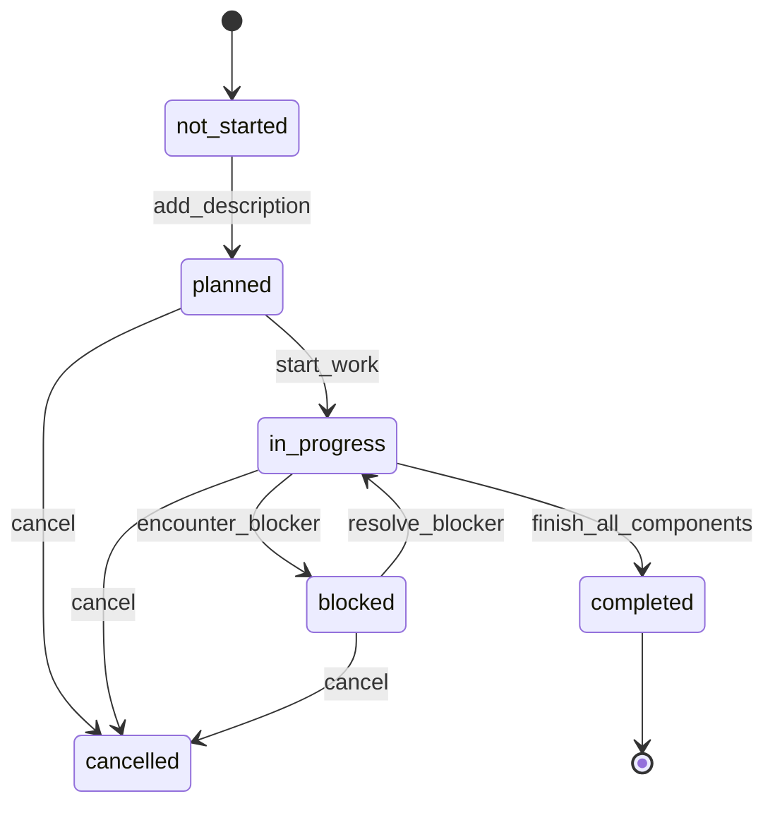
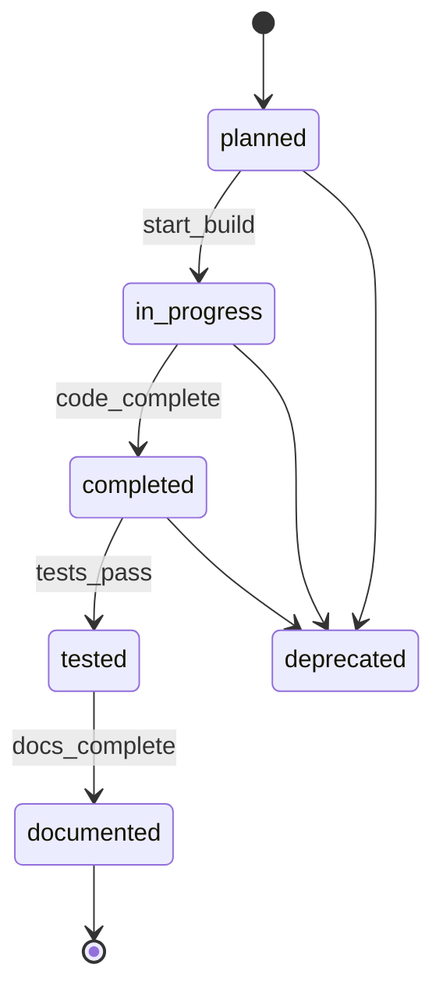
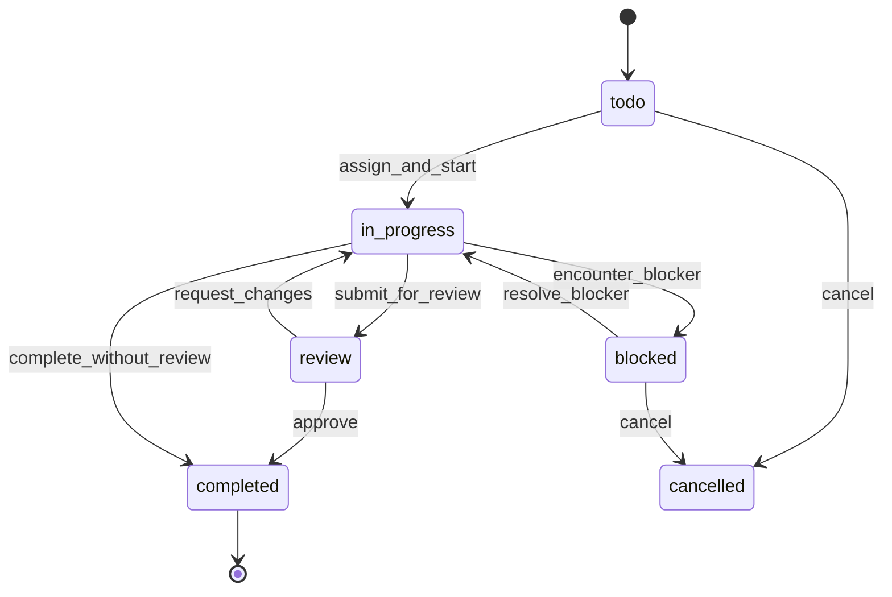
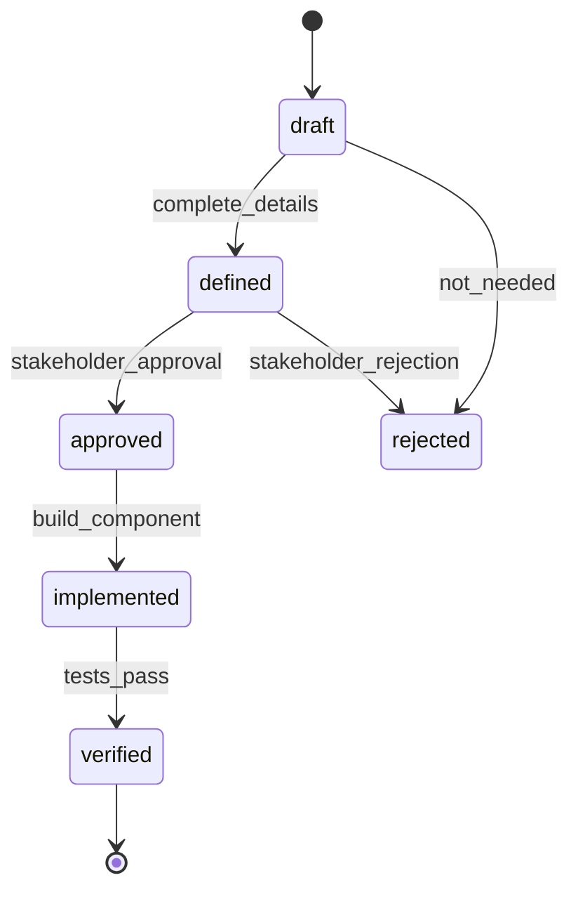

# Build Tracker Data Gateway Specification - Table Analysis

**Purpose**: Detailed analysis of all Build Tracker domain tables, their columns, valid values, and validation rules.

See [[BUILD_TRACKER_SPEC_Overview]] for context and overview.

---

## Table Analysis

### 1. Features Table

**Schema**: `claude.features`

#### Column Definitions

| Column | Type | Nullable | Description |
|--------|------|----------|-------------|
| feature_id | uuid | NO | Primary key |
| feature_name | varchar | YES | Display name |
| feature_type | varchar | YES | Classification |
| description | text | YES | Detailed description |
| parent_feature_id | uuid | YES | Hierarchical parent (self-reference) |
| planned_date | timestamp | YES | When planning occurred |
| planned_by_identity_id | uuid | YES | Who planned it |
| priority | integer | YES | 1-10 (1=highest) |
| status | varchar | YES | Workflow state |
| completion_percentage | integer | YES | Manual progress (0-100) |
| started_date | timestamp | YES | When work began |
| completed_date | timestamp | YES | When completed |
| implemented_by_identity_id | uuid | YES | Who implemented |
| design_doc_path | text | YES | Path to design docs |
| implementation_notes | text | YES | Implementation details |
| created_at | timestamp | YES | Record creation |
| updated_at | timestamp | YES | Last update |
| project_id | uuid | YES | Parent project |

#### Valid Status Values

**Current Values** (found in data):
- `planned` - Feature defined but not started
- `in_progress` - Work has begun
- `completed` - Work finished

**Recommended Values**:
```sql
'not_started'  -- Initial state (replace 'planned')
'planned'      -- Design complete, ready to start
'in_progress'  -- Active development
'blocked'      -- Cannot proceed (should add blocked_reason field)
'on_hold'      -- Paused by decision
'completed'    -- All components done
'cancelled'    -- No longer needed
```

#### Valid Feature Types

**Current Values**:
- `system` - Infrastructure/backend (11 instances)
- `ui` - User interface (22 instances)
- `feature` - Standard feature (1 instance)
- `enhancement` - Improvement to existing (1 instance)
- `integration` - External system connection (1 instance)

**Recommended Values**:
```sql
'feature'      -- New capability
'enhancement'  -- Improvement to existing
'bug_fix'      -- Fixes defect
'refactoring'  -- Code improvement
'integration'  -- External system
'infrastructure' -- Backend/system (replace 'system')
'ui'           -- Frontend only
'api'          -- API endpoint/service
'data'         -- Data model/migration
```

#### Required Fields

**Minimum for Creation**:
- `feature_id` (UUID, auto-generated)
- `feature_name` (varchar, min 5 chars)
- `feature_type` (enum from valid values)
- `status` (default: 'not_started')
- `project_id` (uuid, must exist in projects table)
- `created_at` (timestamp, auto)

**Recommended Additions**:
- `description` (text, min 20 chars) - Required for 'planned' status
- `priority` (integer, 1-10, default: 5)

#### Business Rules

1. **Hierarchical Features**:
   - `parent_feature_id` must reference existing feature if not NULL
   - Prevent circular references (A→B→A)
   - Parent cannot be completed if children are incomplete

2. **Status Transitions**:
   ```
   not_started → planned (requires description)
   planned → in_progress (sets started_date)
   in_progress → blocked (requires blocked_reason field - ADD THIS)
   blocked → in_progress (requires unblock note)
   in_progress → completed (requires all components completed)
   any → cancelled (requires cancellation_reason field - ADD THIS)
   ```

3. **Completion Percentage**:
   - **Current**: Manual field (0-100)
   - **Recommended**: Auto-calculated from components
   ```sql
   completion_percentage = (completed_components / total_components) * 100
   ```
   - If no components exist, base on tasks
   - If neither exist, remain manual

4. **Date Fields**:
   - `started_date` must be NULL when status = 'not_started' or 'planned'
   - `started_date` required when status = 'in_progress', 'blocked', or 'completed'
   - `completed_date` only when status = 'completed'
   - `completed_date` >= `started_date`

5. **Assignment**:
   - `planned_by_identity_id` required when status != 'not_started'
   - `implemented_by_identity_id` required when status = 'in_progress' or 'completed'

#### Workflow Transitions



#### Quality Checks

```python
def validate_feature_create(data):
    checks = []

    # Name validation
    if not data.get('feature_name') or len(data['feature_name']) < 5:
        checks.append("feature_name must be at least 5 characters")

    # Type validation
    if data.get('feature_type') not in VALID_FEATURE_TYPES:
        checks.append(f"Invalid feature_type. Must be one of: {VALID_FEATURE_TYPES}")

    # Project validation
    if not data.get('project_id'):
        checks.append("project_id is required")
    elif not project_exists(data['project_id']):
        checks.append(f"project_id {data['project_id']} does not exist")

    # Parent validation
    if data.get('parent_feature_id'):
        if not feature_exists(data['parent_feature_id']):
            checks.append("parent_feature_id does not exist")
        if would_create_cycle(data['parent_feature_id'], data['feature_id']):
            checks.append("parent_feature_id would create circular reference")

    # Priority validation
    if data.get('priority') and not (1 <= data['priority'] <= 10):
        checks.append("priority must be between 1 and 10")

    return checks

def validate_feature_status_change(feature_id, new_status, reason=None):
    feature = get_feature(feature_id)
    current = feature['status']

    # Define valid transitions
    VALID_TRANSITIONS = {
        'not_started': ['planned', 'cancelled'],
        'planned': ['in_progress', 'cancelled'],
        'in_progress': ['blocked', 'completed', 'cancelled'],
        'blocked': ['in_progress', 'cancelled'],
        'completed': [],  # Terminal state
        'cancelled': []   # Terminal state
    }

    if new_status not in VALID_TRANSITIONS.get(current, []):
        raise ValidationError(
            f"Cannot transition from {current} to {new_status}"
        )

    # Status-specific validation
    if new_status == 'planned' and not feature.get('description'):
        raise ValidationError("description required for planned status")

    if new_status == 'in_progress' and not feature.get('implemented_by_identity_id'):
        raise ValidationError("implemented_by_identity_id required to start work")

    if new_status == 'completed':
        # Check all components are complete
        incomplete = get_incomplete_components(feature_id)
        if incomplete:
            raise ValidationError(
                f"{len(incomplete)} components not completed: {incomplete}"
            )

    if new_status in ['blocked', 'cancelled'] and not reason:
        raise ValidationError(f"reason required for {new_status} status")

    return True
```

---

### 2. Components Table

**Schema**: `claude.components`

#### Column Definitions

| Column | Type | Nullable | Description |
|--------|------|----------|-------------|
| component_id | uuid | NO | Primary key |
| feature_id | uuid | YES | Parent feature |
| component_name | varchar | YES | Display name |
| component_type | varchar | YES | Classification |
| file_path | text | YES | Source file location |
| planned_functions | text[] | YES | Expected functions |
| planned_dependencies | text[] | YES | Expected dependencies |
| status | varchar | YES | Workflow state |
| actual_functions | text[] | YES | Implemented functions |
| lines_of_code | integer | YES | LOC count |
| has_tests | boolean | YES | Test coverage exists |
| test_coverage_percentage | integer | YES | % covered (0-100) |
| has_documentation | boolean | YES | Docs exist |
| doc_path | text | YES | Documentation location |
| created_at | timestamp | YES | Record creation |
| updated_at | timestamp | YES | Last update |
| implemented_at | timestamp | YES | When implemented |

#### Valid Status Values

**Current Values** (found in data):
- `planned` - Designed but not built (22 instances)
- `complete` - Built (7 instances) **⚠️ Inconsistent**
- `completed` - Built (81 instances)

**Recommended Values** (standardize to `completed`):
```sql
'planned'      -- Designed, not started
'in_progress'  -- Being built
'completed'    -- Built and integrated
'tested'       -- Tests passing
'documented'   -- Documentation complete
'deprecated'   -- No longer used
```

#### Valid Component Types

**Current Values**:
- `component` - Generic (40 instances)
- `service` - Backend service (16 instances)
- `ui` - UI component (19 instances)
- `module` - Module (13 instances)
- `api` - API endpoint (10 instances)
- `dialog` - Dialog/modal (3 instances)
- `hook` - React hook (3 instances)
- `page` - Full page (2 instances)
- `layout` - Layout component (1 instance)
- `store` - State store (1 instance)
- `database` - DB schema (1 instance)
- `crud` - CRUD operations (1 instance)

**Recommended Values**:
```sql
-- Frontend
'ui_component'  -- Reusable UI (combine 'component' + 'ui')
'page'          -- Full page
'layout'        -- Layout wrapper
'dialog'        -- Modal/dialog
'hook'          -- React hook
'store'         -- State management

-- Backend
'api_endpoint'  -- REST/GraphQL endpoint (combine 'api')
'service'       -- Business logic service
'repository'    -- Data access layer
'middleware'    -- Request processing
'worker'        -- Background job
'database'      -- Schema/migration

-- Shared
'module'        -- Standalone module
'utility'       -- Helper functions
'config'        -- Configuration
'types'         -- TypeScript types
'test'          -- Test suite
```

#### Required Fields

**Minimum for Creation**:
- `component_id` (UUID, auto-generated)
- `feature_id` (UUID, must exist in features)
- `component_name` (varchar, min 3 chars)
- `component_type` (enum from valid values)
- `status` (default: 'planned')
- `created_at` (timestamp, auto)

**For Status='completed'**:
- `file_path` (text, must be valid file path)
- `actual_functions` (text[], at least one function)

#### Business Rules

1. **Feature Relationship**:
   - `feature_id` must reference existing feature
   - Component cannot be 'completed' if feature is 'not_started'
   - Component status change triggers feature completion % update

2. **Status Transitions**:
   ```
   planned → in_progress (start building)
   in_progress → completed (code complete, sets implemented_at)
   completed → tested (tests passing, requires has_tests=true)
   tested → documented (docs written, requires has_documentation=true)
   any → deprecated (mark as obsolete)
   ```

3. **Code Quality**:
   - `has_tests` should be true for status='tested'
   - `test_coverage_percentage` required if `has_tests=true`
   - `test_coverage_percentage` should be 0-100
   - Warn if coverage < 80% for critical components

4. **File Path Validation**:
   - `file_path` must be valid relative path when status='completed'
   - File should exist if `file_path` provided
   - Generate file path from component_name and type if not provided

5. **Function Tracking**:
   - `actual_functions` should match `planned_functions` when completed
   - Alert if actual differs significantly from planned
   - Empty `actual_functions` invalid for status='completed'

6. **Documentation**:
   - `has_documentation=true` requires `doc_path`
   - `doc_path` should point to valid markdown file
   - Warn if component is 'completed' but `has_documentation=false`

#### Workflow Transitions



#### Quality Checks

```python
def validate_component_create(data):
    checks = []

    # Name validation
    if not data.get('component_name') or len(data['component_name']) < 3:
        checks.append("component_name must be at least 3 characters")

    # Type validation
    if data.get('component_type') not in VALID_COMPONENT_TYPES:
        checks.append(f"Invalid component_type: {data.get('component_type')}")

    # Feature validation
    if not data.get('feature_id'):
        checks.append("feature_id is required")
    else:
        feature = get_feature(data['feature_id'])
        if not feature:
            checks.append(f"feature_id {data['feature_id']} does not exist")
        elif feature['status'] == 'cancelled':
            checks.append("Cannot add component to cancelled feature")

    return checks

def validate_component_completion(component_id):
    component = get_component(component_id)
    checks = []

    # File path required
    if not component.get('file_path'):
        checks.append("file_path required for completion")

    # Functions required
    if not component.get('actual_functions') or len(component['actual_functions']) == 0:
        checks.append("actual_functions required (at least one)")

    # Compare with planned
    planned = set(component.get('planned_functions') or [])
    actual = set(component.get('actual_functions') or [])

    missing = planned - actual
    if missing:
        checks.append(f"Missing planned functions: {missing}")

    extra = actual - planned
    if extra:
        checks.append(f"WARNING: Extra functions not planned: {extra}")

    # Test coverage check
    if not component.get('has_tests'):
        checks.append("WARNING: No tests for this component")
    elif component.get('test_coverage_percentage', 0) < 80:
        checks.append(
            f"WARNING: Low test coverage: {component['test_coverage_percentage']}%"
        )

    return checks
```

---

### 3. Build Tasks Table

**Schema**: `claude.build_tasks`

#### Column Definitions

| Column | Type | Nullable | Description |
|--------|------|----------|-------------|
| task_id | uuid | NO | Primary key |
| component_id | uuid | YES | Parent component |
| feature_id | uuid | YES | Parent feature |
| task_name | varchar | YES | Display name |
| task_description | text | YES | Detailed description |
| task_type | varchar | YES | Classification |
| status | varchar | YES | Workflow state |
| priority | integer | YES | 1-10 (1=highest) |
| assigned_to_identity_id | uuid | YES | Who's working on it |
| estimated_hours | numeric | YES | Planned effort |
| actual_hours | numeric | YES | Actual effort |
| started_at | timestamp | YES | When work began |
| completed_at | timestamp | YES | When finished |
| blocked_reason | text | YES | Why blocked |
| blocked_by_task_id | uuid | YES | Dependency blocking |
| created_at | timestamp | YES | Record creation |
| updated_at | timestamp | YES | Last update |

#### Valid Status Values

**Current Values** (found in data):
- `todo` - Not started (89 instances)
- `completed` - Finished (60 instances)

**Recommended Values**:
```sql
'todo'         -- Not started (keep existing)
'in_progress'  -- Being worked on
'blocked'      -- Cannot proceed
'review'       -- Ready for review
'completed'    -- Done (keep existing)
'cancelled'    -- No longer needed
```

#### Valid Task Types

**Current Values**:
- `code` - Coding task (139 instances)
- `test` - Testing task (10 instances)

**Recommended Values**:
```sql
'code'         -- Write code
'test'         -- Write tests
'review'       -- Code review
'design'       -- Design/architecture
'documentation' -- Write docs
'research'     -- Investigation
'bug_fix'      -- Fix defect
'refactor'     -- Improve code
'deployment'   -- Deploy/release
'meeting'      -- Discussion/planning
```

#### Required Fields

**Minimum for Creation**:
- `task_id` (UUID, auto-generated)
- `task_name` (varchar, min 5 chars)
- `task_description` (text, min 10 chars)
- `task_type` (enum from valid values)
- `status` (default: 'todo')
- `created_at` (timestamp, auto)

**MUST Have One**:
- `component_id` OR `feature_id` (at least one required)

**For Status='in_progress'**:
- `assigned_to_identity_id` (UUID, must exist)
- `started_at` (timestamp, auto-set)

**For Status='completed'**:
- `completed_at` (timestamp, auto-set)
- `actual_hours` (numeric, > 0)

#### Business Rules

1. **Parent Relationship**:
   - Must have `component_id` OR `feature_id` (one is required)
   - If both provided, component must belong to that feature
   - Task cannot be 'completed' if parent is 'todo'/'not_started'

2. **Status Transitions**:
   ```
   todo → in_progress (requires assignment)
   in_progress → blocked (requires blocked_reason)
   blocked → in_progress (requires resolution note)
   in_progress → review (requires completion)
   review → in_progress (if changes requested)
   review → completed (if approved)
   in_progress → completed (if no review needed)
   any → cancelled (requires reason)
   ```

3. **Blocking**:
   - If status='blocked' and `blocked_by_task_id` provided, that task must exist
   - Cannot block self (task_id != blocked_by_task_id)
   - Cannot complete if blocking other incomplete tasks
   - Circular blocking detection (A blocks B blocks C blocks A)

4. **Time Tracking**:
   - `actual_hours` only when status='completed'
   - `actual_hours` should be > 0
   - Warn if `actual_hours` > 2x `estimated_hours` (estimate accuracy)
   - `completed_at` >= `started_at`
   - Calculate velocity: `estimated_hours` / `actual_hours`

5. **Assignment**:
   - `assigned_to_identity_id` required for status='in_progress', 'review', 'completed'
   - Can reassign tasks in 'todo' or 'blocked' status
   - Cannot unassign task in 'in_progress'

6. **Priority**:
   - Range: 1-10 (1=highest priority)
   - Default: 5 (medium)
   - Tasks with priority 1-3 should be started within 24 hours

#### Workflow Transitions



#### Quality Checks

```python
def validate_task_create(data):
    checks = []

    # Name validation
    if not data.get('task_name') or len(data['task_name']) < 5:
        checks.append("task_name must be at least 5 characters")

    # Description validation
    if not data.get('task_description') or len(data['task_description']) < 10:
        checks.append("task_description must be at least 10 characters")

    # Type validation
    if data.get('task_type') not in VALID_TASK_TYPES:
        checks.append(f"Invalid task_type: {data.get('task_type')}")

    # Parent validation (one required)
    if not data.get('component_id') and not data.get('feature_id'):
        checks.append("Either component_id or feature_id is required")

    # If both provided, validate relationship
    if data.get('component_id') and data.get('feature_id'):
        component = get_component(data['component_id'])
        if component['feature_id'] != data['feature_id']:
            checks.append("component_id does not belong to feature_id")

    # Priority validation
    if data.get('priority') and not (1 <= data['priority'] <= 10):
        checks.append("priority must be between 1 and 10")

    # Estimate validation
    if data.get('estimated_hours') and data['estimated_hours'] <= 0:
        checks.append("estimated_hours must be positive")

    return checks

def validate_task_start(task_id, identity_id):
    task = get_task(task_id)
    checks = []

    # Must be in todo status
    if task['status'] != 'todo':
        checks.append(f"Cannot start task with status: {task['status']}")

    # Identity must exist
    if not identity_exists(identity_id):
        checks.append(f"identity_id {identity_id} does not exist")

    # Check if blocked
    if task.get('blocked_by_task_id'):
        blocking_task = get_task(task['blocked_by_task_id'])
        if blocking_task['status'] != 'completed':
            checks.append(
                f"Task blocked by: {blocking_task['task_name']} "
                f"(status: {blocking_task['status']})"
            )

    return checks

def validate_task_completion(task_id, actual_hours):
    task = get_task(task_id)
    checks = []

    # Must be in in_progress or review
    if task['status'] not in ['in_progress', 'review']:
        checks.append(f"Cannot complete task with status: {task['status']}")

    # Actual hours required
    if not actual_hours or actual_hours <= 0:
        checks.append("actual_hours must be positive")

    # Check estimate accuracy
    if task.get('estimated_hours'):
        ratio = actual_hours / task['estimated_hours']
        if ratio > 2.0:
            checks.append(
                f"WARNING: Actual hours ({actual_hours}) is {ratio:.1f}x "
                f"the estimate ({task['estimated_hours']})"
            )

    return checks
```

---

### 4. Requirements Table

**Schema**: `claude.requirements`

#### Column Definitions

| Column | Type | Nullable | Description |
|--------|------|----------|-------------|
| requirement_id | uuid | NO | Primary key |
| feature_id | uuid | YES | Parent feature |
| requirement_name | varchar | YES | Display name |
| requirement_type | varchar | YES | Classification |
| description | text | YES | Detailed description |
| acceptance_criteria | text[] | YES | Success criteria |
| status | varchar | YES | Workflow state |
| priority | integer | YES | 1-10 (1=highest) |
| must_have | boolean | YES | Critical for feature |
| implemented_by_component_id | uuid | YES | Which component implements |
| verified_at | timestamp | YES | When verified |
| created_at | timestamp | YES | Record creation |
| updated_at | timestamp | YES | Last update |
| created_by_identity_id | uuid | YES | Who created |

#### Valid Status Values

**Current Values** (found in data):
- `defined` - Documented (109 instances)

**Recommended Values**:
```sql
'draft'        -- Being written
'defined'      -- Fully documented (keep existing)
'approved'     -- Stakeholder approved
'implemented'  -- Code complete
'verified'     -- Tests passing
'rejected'     -- Not needed
```

#### Valid Requirement Types

**Current Values**:
- `ui` - User interface (70 instances)
- `data` - Data/model (15 instances)
- `api` - API endpoint (10 instances)
- `functional` - Functional behavior (7 instances)
- `config` - Configuration (4 instances)
- `performance` - Performance goal (3 instances)

**Recommended Values**:
```sql
-- By Layer
'ui'           -- User interface
'api'          -- API/endpoint
'data'         -- Data model/storage
'integration'  -- External system

-- By Category
'functional'   -- What it does
'performance'  -- Speed/scale goal
'security'     -- Security requirement
'usability'    -- UX requirement
'accessibility' -- A11y requirement
'compliance'   -- Regulatory/legal
'config'       -- Configuration need
'deployment'   -- Deployment requirement
```

#### Required Fields

**Minimum for Creation**:
- `requirement_id` (UUID, auto-generated)
- `feature_id` (UUID, must exist in features)
- `requirement_name` (varchar, min 5 chars)
- `requirement_type` (enum from valid values)
- `description` (text, min 20 chars)
- `acceptance_criteria` (text[], at least one item)
- `status` (default: 'draft')
- `must_have` (boolean, default: false)
- `created_at` (timestamp, auto)
- `created_by_identity_id` (UUID, must exist)

**For Status='approved'**:
- `acceptance_criteria` must have at least 3 items
- `description` must be > 50 chars

**For Status='verified'**:
- `implemented_by_component_id` required
- `verified_at` timestamp required

#### Business Rules

1. **Feature Relationship**:
   - `feature_id` must reference existing feature
   - Cannot be 'verified' if feature is 'not_started' or 'planned'
   - All `must_have=true` requirements must be 'verified' before feature completion

2. **Status Transitions**:
   ```
   draft → defined (complete description + criteria)
   defined → approved (stakeholder approval)
   approved → implemented (component built)
   implemented → verified (tests pass, sets verified_at)
   draft → rejected (not needed)
   defined → rejected (stakeholder rejection)
   ```

3. **Acceptance Criteria**:
   - Must have at least 1 criterion
   - Each criterion should be testable
   - Criteria cannot be empty strings
   - Recommend format: "Given/When/Then" or "Should/Must"

4. **Component Implementation**:
   - `implemented_by_component_id` must exist
   - Component must be status='completed' or 'tested'
   - One component can implement multiple requirements
   - Track coverage: requirements per component

5. **Must-Have Requirements**:
   - `must_have=true` requirements cannot be 'rejected'
   - Feature cannot be 'completed' if any `must_have` requirement is not 'verified'
   - Warn if feature has zero `must_have` requirements

6. **Verification**:
   - `verified_at` only when status='verified'
   - Verification requires tests to pass
   - Link to test run ID (add `verified_by_test_run_id` field?)

#### Workflow Transitions



#### Quality Checks

```python
def validate_requirement_create(data):
    checks = []

    # Name validation
    if not data.get('requirement_name') or len(data['requirement_name']) < 5:
        checks.append("requirement_name must be at least 5 characters")

    # Description validation
    if not data.get('description') or len(data['description']) < 20:
        checks.append("description must be at least 20 characters")

    # Type validation
    if data.get('requirement_type') not in VALID_REQUIREMENT_TYPES:
        checks.append(f"Invalid requirement_type: {data.get('requirement_type')}")

    # Feature validation
    if not data.get('feature_id'):
        checks.append("feature_id is required")
    elif not feature_exists(data['feature_id']):
        checks.append(f"feature_id {data['feature_id']} does not exist")

    # Acceptance criteria validation
    if not data.get('acceptance_criteria') or len(data['acceptance_criteria']) == 0:
        checks.append("At least one acceptance criterion is required")
    else:
        for i, criterion in enumerate(data['acceptance_criteria']):
            if not criterion or len(criterion.strip()) == 0:
                checks.append(f"Acceptance criterion {i+1} is empty")

    # Creator validation
    if not data.get('created_by_identity_id'):
        checks.append("created_by_identity_id is required")

    return checks

def validate_requirement_approval(requirement_id):
    req = get_requirement(requirement_id)
    checks = []

    # Must be in 'defined' status
    if req['status'] != 'defined':
        checks.append(f"Cannot approve requirement with status: {req['status']}")

    # Description length check
    if len(req['description']) < 50:
        checks.append("Description too short for approval (min 50 chars)")

    # Acceptance criteria count
    if len(req.get('acceptance_criteria') or []) < 3:
        checks.append("Need at least 3 acceptance criteria for approval")

    # Check criteria quality
    for criterion in req.get('acceptance_criteria') or []:
        if not any(word in criterion.lower() for word in ['should', 'must', 'given', 'when', 'then']):
            checks.append(
                f"WARNING: Criterion may not be testable: '{criterion}'"
            )

    return checks

def validate_requirement_verification(requirement_id, component_id):
    req = get_requirement(requirement_id)
    checks = []

    # Must be in 'implemented' status
    if req['status'] != 'implemented':
        checks.append(f"Cannot verify requirement with status: {req['status']}")

    # Component must exist and be tested
    component = get_component(component_id)
    if not component:
        checks.append(f"component_id {component_id} does not exist")
    elif component['status'] not in ['completed', 'tested', 'documented']:
        checks.append(
            f"Component status is '{component['status']}', "
            f"must be completed/tested"
        )

    # Check test coverage
    if not component.get('has_tests'):
        checks.append("WARNING: Component has no tests")
    elif component.get('test_coverage_percentage', 0) < 80:
        checks.append(
            f"WARNING: Low test coverage for component: "
            f"{component['test_coverage_percentage']}%"
        )

    return checks
```

---

**Version**: 2.0 (Split from original spec)
**Date Split**: 2025-12-26
**Original Version**: 1.0
**Original Date**: 2025-12-04
**Location**: docs/BUILD_TRACKER_SPEC_Table_Analysis.md

See [[BUILD_TRACKER_SPEC_Overview]] for overview and [[BUILD_TRACKER_SPEC_Workflows]] for workflow specifications.
