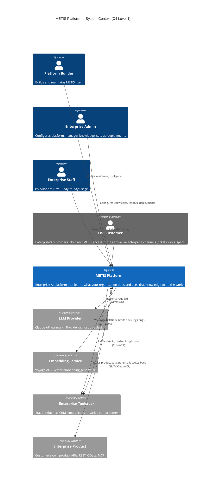
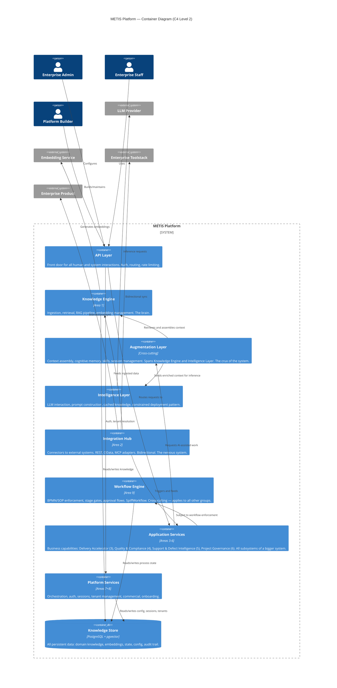

---
tags:
  - project/Project-Metis
  - scope/system
  - type/gate-zero
  - gate/zero
created: 2026-03-08
updated: 2026-03-08
status: validated
---

# System Map (C4 Level 1 & Level 2)

Gate Zero Document 4.

## Purpose

This document shows what METIS is, what it connects to, and what's inside it — at a level appropriate for Gate Zero. It does not define deployment boundaries or container technology choices (Gate 2 concerns). It establishes the system boundary and the logical groupings within.

---

## C4 Level 1 — System Context

What METIS is and what it interacts with.

### Actors

| Actor | Access | How |
|---|---|---|
| Platform Builder | Direct | Builds and maintains METIS itself |
| Enterprise Admin | Direct | Configures platform, manages knowledge, tenant setup |
| Enterprise Staff (PS, Support, Dev) | Direct | Day-to-day AI-assisted work |
| End Customer | **Indirect only** | Inputs arrive via enterprise channels (project docs/specs ingested by PS, bugs logged internally by PS, support tickets triaged and forwarded). No direct METIS access. Direct chat interface is future-state possibility. |

### External Systems

| System | Direction | Protocols | Purpose |
|---|---|---|---|
| LLM Provider | Outbound | HTTPS/API | Inference — prompt completion, analysis, generation |
| Embedding Service | Outbound | HTTPS/API | Vector embedding generation for knowledge retrieval |
| Enterprise Toolstack | Bidirectional | REST, MCP | Read tickets/docs/project data in; push insights, reports, updates out |
| Enterprise Product | Bidirectional | REST, OData, MCP | Read product config/data; potentially write back |

### Key L1 Decisions

- End Customers have no direct METIS access in initial scope. Their inputs flow through enterprise channels into METIS via the Integration Hub.
- External system integration is a pragmatic necessity — data lives in those systems today. METIS connects to them rather than replacing them.
- MCP is explicitly supported alongside REST and OData as an integration protocol for Enterprise Products.
- LLM provider dependency is acknowledged (Assumption 1 from Gate Zero Doc 2) but designed provider-agnostic.

---

## C4 Level 2 — Container Diagram (Logical Groupings)

What's inside METIS. At Gate Zero these are **logical groupings**, not deployment containers. Container boundaries and technology choices are Gate 2 decisions.

### Logical Groupings

| # | Group | Areas | Role | Metaphor |
|---|---|---|---|---|
| 1 | Knowledge Store | — | All persistent data: knowledge, embeddings, state, config, audit | The foundation |
| 2 | Knowledge Engine | Area 1 | Ingestion, retrieval, RAG pipeline, embedding management | The brain (storage) |
| 3 | **Augmentation Layer** | Cross-cutting | Context assembly, cognitive memory, skills, session management. Spans Knowledge Engine and Intelligence Layer. | **The bridge** |
| 4 | Intelligence Layer | — | LLM interaction, prompt construction, constrained deployment pattern, cached knowledge | The mind (reasoning) |
| 5 | Integration Hub | Area 2 | External system connectors: REST, OData, MCP. Bidirectional. | The nervous system |
| 6 | Workflow Engine | Area 9 | BPMN/SOP enforcement, stage gates, approvals. Cross-cutting. | The rulebook |
| 7 | Application Services | Areas 3, 4, 5, 6 | Business capabilities — all subsystems consuming the Augmentation Layer | The muscle |
| 8 | Platform Services | Areas 7, 8 | Orchestration, auth, sessions, tenant management, commercial | The skeleton |
| 9 | API Layer | — | Front door for all interactions. Auth, routing, rate limiting. | The gateway |

### The Augmentation Layer (Cross-Cutting)

The Augmentation Layer is the most critical part of METIS. It sits between the Knowledge Engine and Intelligence Layer, assembling the right context for every AI interaction. It is what makes METIS an AI that understands your domain rather than a generic LLM with a database.

**If this doesn't work well with non-technical people in a contained sandbox, nothing else matters.**

| Subsystem | What It Does | Current State |
|---|---|---|
| Cognitive Memory | Multi-tier memory (short/mid/long), promotion, decay, dedup/merge | Working in Claude Family |
| RAG Pipeline | Embed, store, retrieve, inject relevant context | Working — Voyage AI + pgvector |
| Skills System | Procedural knowledge — how to do specific tasks | Working — SKILL.md convention |
| Session Management | Continuity across sessions — handoffs, facts, checkpoints | Working |
| Knowledge Relations | Typed relationships between knowledge entries, graph walking | Working |
| Context Assembly | Orchestrates all the above into a single enriched context for the LLM | Implicit — needs explicit design |

Industry research on cognitive architecture and context engineering confirms this pattern. See `research/augmentation-layer-research.md` for full analysis and competitive landscape.

### Application Services Subsystems (Areas 3–6)

These are grouped as one logical container at L2 because they follow the same pattern: take knowledge, apply intelligence, produce output for a specific domain. Whether they become separate containers is a Gate 2 decision.

| Area | Subsystem | What It Does |
|---|---|---|
| 3 | Delivery Accelerator | AI-assisted implementation/configuration pipeline |
| 4 | Quality & Compliance | Automated testing, validation, compliance monitoring |
| 5 | Support & Defect Intelligence | AI triage, pattern detection, defect lifecycle |
| 6 | Project Governance | Dashboards, health scoring, status reporting |

### Key Relationships

- **Application Services → Augmentation Layer:** All business capabilities request AI-assisted work through the Augmentation Layer, which assembles context and coordinates between Knowledge Engine and Intelligence Layer.
- **Augmentation Layer → Knowledge Engine:** Retrieves domain knowledge, memory, and context.
- **Augmentation Layer → Intelligence Layer:** Sends enriched, assembled context for LLM inference.
- **Integration Hub → Knowledge Engine:** External data feeds into the knowledge store via ingestion.
- **Integration Hub → Application Services:** External events (new ticket, deployment, etc.) trigger business capability workflows.
- **Workflow Engine → everything:** Cross-cutting enforcement. Stage gates and approvals apply across all groups.
- **Platform Services underpins:** Auth, sessions, tenant isolation, commercial — the infrastructure everything runs on.

### What This Diagram Does NOT Define

- **Deployment boundaries** — whether groups become separate services, microservices, or modules within a monolith is a Gate 2 decision
- **Technology choices per group** — beyond PostgreSQL + pgvector (proven) and SpiffWorkflow (decided), tech is deferred
- **Internal APIs between groups** — interface contracts are Gate 2 Doc 7
- **Security boundaries** — Gate 2 Doc 8 (flagged as known gap)
- **Augmentation Layer internals** — subsystem decomposition is a Gate 2 concern. See `research/augmentation-layer-research.md` for design direction.

---

## Mapping: 9 Areas → Logical Groups

| Area | Area Name | Maps To |
|---|---|---|
| 1 | Knowledge Engine | Knowledge Engine |
| 2 | Integration Hub | Integration Hub |
| 3 | Delivery Accelerator | Application Services |
| 4 | Quality & Compliance | Application Services |
| 5 | Support & Defect Intelligence | Application Services |
| 6 | Project Governance | Application Services |
| 7 | Orchestration & Infrastructure | Platform Services |
| 8 | Commercial | Platform Services |
| 9 | BPMN / SOP & Enforcement | Workflow Engine |

Plus three cross-cutting groups not tied to a single area:
- **Augmentation Layer** — context assembly, cognitive memory, skills, RAG orchestration. Spans Knowledge Engine + Intelligence Layer. The crux of the system.
- **Intelligence Layer** — LLM interaction concerns, constrained deployment pattern
- **API Layer** — the front door

---

*Gate Zero Doc 4 | Validated: 2026-03-08 | Author: John de Vere + Claude Desktop*

---
**Version**: 1.0
**Created**: 2026-03-08
**Updated**: 2026-03-08
**Location**: knowledge-vault/10-Projects/Project-Metis/gates/gate-zero/system-map.md
