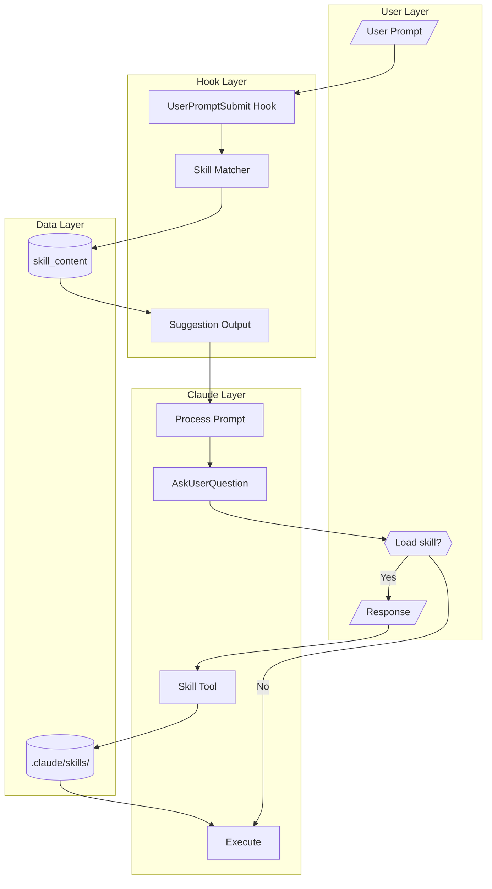

---
projects:
  - claude-family
tags:
  - architecture
  - skills
  - hooks
synced: false
---

# Dynamic Skill System - BPMN Diagram

## Flow Diagram (Mermaid)



## Flow Description

1. **User Prompt** → UserPromptSubmit hook fires
2. **Skill Matcher** → Extracts keywords, queries skill_content
3. **Suggestion** → Returns name + description (NOT full content)
4. **Claude Decides** → Based on confidence and task complexity
5. **Load or Skip** → Skill tool loads full file if needed

## Suggestion Format

```
═══════════════════════════════════════════════════
SKILL SUGGESTION (confidence: 0.85)
═══════════════════════════════════════════════════
Recommended: /architect
Description: Cloud architecture, system design, NFR
Action: Use Skill tool to load if task is complex
═══════════════════════════════════════════════════
```

## Decision Rules (for CLAUDE.md)

| Confidence | Task Complexity | Action |
|------------|-----------------|--------|
| > 0.8 | Complex (3+ files) | Auto-load |
| > 0.5 | Any | Ask user |
| < 0.5 | Any | Ignore |

---

## Related Documents

- [[Skill Catalog]] - Complete list of available skills
- [[Dynamic Skill System - Transformation Guide]] - How to convert skills

---

**Version**: 1.1
**Created**: 2026-01-24
**Updated**: 2026-01-24
**Location**: knowledge-vault/30-Patterns/Dynamic Skill System - BPMN Diagram.md
