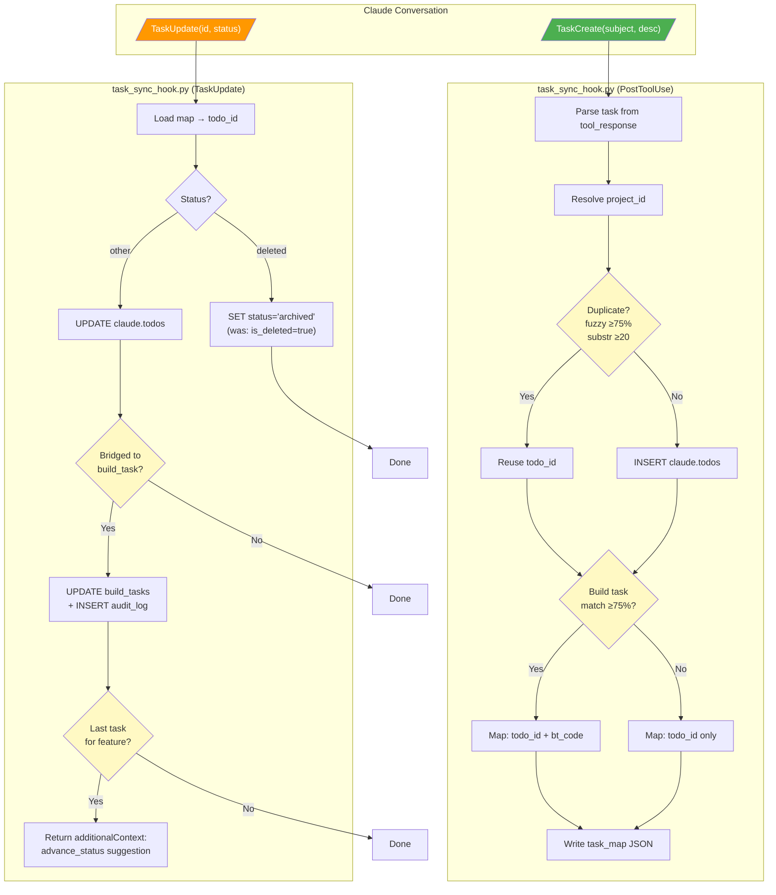
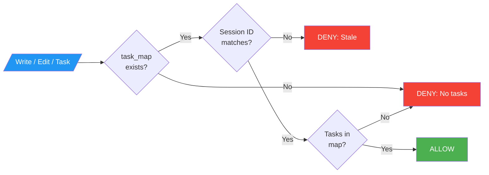
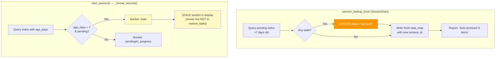

---
projects:
  - claude-family
tags:
  - architecture
  - tasks
  - hooks
  - workflow
synced: false
---

# Task & Todo Lifecycle - BPMN Diagram

How work items flow through the system: creation, sync, state transitions, and completion.

**Detail diagrams**: [[Task Todo Lifecycle - Detail Flows]]

---

## Overview: The Two Paths

Work enters via two paths converging at `claude.todos`:

1. **TaskCreate path** (primary) - In-memory task → DB sync → build_task bridge
2. **TodoWrite path** (legacy) - Direct DB sync (no bridging)

Both enforced by **task_discipline_hook** which blocks Write/Edit until tasks exist.

---

## Diagram 1: Task Creation & Sync Flow



---

## Diagram 2: Task Discipline Gate



**Not gated**: Read, Grep, Glob, Bash, WebSearch (research tools always allowed)

---

## Diagram 3: Staleness & Auto-Archive



**Key rules**:
- `deleted` via TaskUpdate → maps to `archived` (preserves audit trail)
- Pending >7 days → auto-archived on SessionStart
- Stale items shown in resume display but NOT restored via TaskCreate
- `in_progress` items are NEVER auto-archived (interrupted work, not abandoned)

---

## State Machine Reference

### Build Tasks
```
todo ──→ in_progress ──→ completed
  │          │
  └──→ cancelled   └──→ blocked ──→ in_progress
```

### Features
```
draft ──→ planned ──→ in_progress ──→ completed (requires all_tasks_done)
             │            │
             └──→ cancelled   └──→ blocked
```

### Feedback
```
new ──→ triaged ──→ in_progress ──→ resolved
  │        │            │
  └──→ duplicate  └──→ wont_fix   └──→ wont_fix
```

---

## Data Store Summary

| Store | Type | Written By | Lifetime |
|-------|------|-----------|----------|
| TaskList | In-memory | TaskCreate/TaskUpdate | Session only |
| task_map JSON | Temp file | task_sync_hook | Session (temp dir) |
| claude.todos | DB table | task_sync_hook, todo_sync_hook | Persistent |
| claude.build_tasks | DB table | MCP tools, task_sync_hook | Persistent |
| claude.features | DB table | MCP tools | Persistent |
| claude.audit_log | DB table | WorkflowEngine, task_sync_hook | Immutable |
| claude.session_state | DB table | start_work, complete_work | Per-project |

---

## Todo Status Flow

```
pending ──→ in_progress ──→ completed
  │              │
  └──→ archived  └──→ archived (manual only)
       (auto: >7d)
       (manual: TaskUpdate 'deleted')
```

Valid statuses: `pending`, `in_progress`, `completed`, `cancelled`, `archived`

---

## Known Gaps

| # | Issue | Impact | Status |
|---|-------|--------|--------|
| 1 | Raw SQL bypasses WorkflowEngine (no DB triggers) | Medium | Open |
| 2 | ~~Stale task_map blocks Write/Edit after crash~~ | ~~Medium~~ | **Fixed** (task_map reset on SessionStart) |
| 3 | TodoWrite doesn't bridge to build_tasks | Low | By design |
| 4 | ~~Feature completion is advisory only~~ | ~~Low~~ | **Improved** (additionalContext surfaced) |
| 5 | `create_feature` skips 'draft', starts at 'planned' | Low | Open |
| 6 | Feedback priority=string, features priority=int | Low | Open |

---

**Version**: 1.1
**Created**: 2026-02-16
**Updated**: 2026-02-16
**Location**: knowledge-vault/30-Patterns/Task Todo Lifecycle - BPMN Diagram.md
