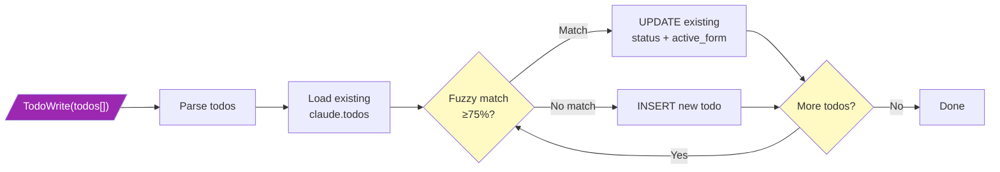
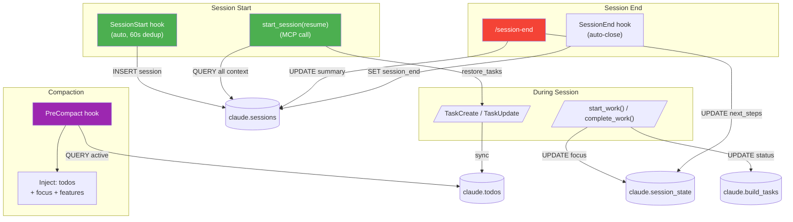

---
projects:
  - claude-family
tags:
  - architecture
  - tasks
  - hooks
  - workflow
synced: false
---

# Task & Todo Lifecycle - Detail Flows

MCP work lifecycle, TodoWrite sync, and session context preservation diagrams.

**Overview & core diagrams**: [[Task Todo Lifecycle - BPMN Diagram]]

---

## Diagram 3: MCP Work Lifecycle (Features → Tasks → Completion)

Full lifecycle using project-tools MCP server and WorkflowEngine.

```mermaid
flowchart TB
    subgraph Create["Creation Phase"]
        CF[/"create_feature(name)"/]
        AT[/"add_build_task(feature, name)"\nor "create_linked_task(...)"/]
    end

    subgraph Work["Execution Phase"]
        SW[/"start_work(BT_code)"/]
        CW[/"complete_work(BT_code)"/]
    end

    subgraph Engine["WorkflowEngine"]
        VT{"Valid\ntransition?"}
        CC{"Condition\nmet?"}
        UP["UPDATE status"]
        SE["Execute side_effects"]
        LOG["INSERT audit_log"]
        ERR1["ERROR: invalid\n+ valid options"]
        ERR2["ERROR: condition\nfailed + reason"]
    end

    subgraph Check["Completion Check"]
        FC{"All tasks\ncompleted?"}
        SUG["Suggest: advance\nfeature to completed"]
        NEXT["Return: next\ntodo task"]
    end

    CF -->|"INSERT features\nstatus='planned'"| SW
    AT -->|"INSERT build_tasks\nstatus='todo'"| SW

    SW --> VT
    CW --> VT
    VT -->|"No"| ERR1
    VT -->|"Yes"| CC
    CC -->|"Failed"| ERR2
    CC -->|"Passed"| UP --> SE --> LOG

    CW -.-> FC
    FC -->|"Yes"| SUG
    FC -->|"No"| NEXT

    style CF fill:#4CAF50,color:white
    style AT fill:#4CAF50,color:white
    style SW fill:#2196F3,color:white
    style CW fill:#FF9800,color:white
    style ERR1 fill:#F44336,color:white
    style ERR2 fill:#F44336,color:white
    style VT fill:#FFF9C4
    style CC fill:#FFF9C4
    style FC fill:#FFF9C4
```

### WorkflowEngine Internals

1. **validate_transition**: Query `workflow_transitions` for `(entity_type, from_status, to_status)`
2. **check_condition**: If `requires_condition` set (e.g. `all_tasks_done`), evaluate it
3. **execute**: UPDATE entity status, run `side_effect` (e.g. `check_feature_completion`)
4. **audit**: INSERT into `audit_log` with `change_source`, `side_effects_executed`
5. **rollback**: On any exception, `conn.rollback()` — status not changed

---

## Diagram 4: TodoWrite Sync Flow (Legacy Path)



**Key difference from TaskCreate**: No build_task bridging. No task_map. No discipline gate.

**No auto-deletion**: Todos missing from the call are NOT deleted (prevents accidental loss).

---

## Diagram 5: Session Lifecycle & Context Preservation



### Context Preservation Flow

| Event | What's Saved | Where |
|-------|-------------|-------|
| TaskCreate | Task content + bridge | claude.todos + task_map |
| start_work | Current focus | claude.session_state |
| PreCompact | Active todos + focus + features | Injected into systemMessage |
| /session-end | Summary + learnings + next_steps | claude.sessions + session_state |
| SessionEnd hook | session_end timestamp | claude.sessions |

### Session Resume Flow

1. `start_session(resume=true)` queries all tables in one call
2. Returns pre-formatted display box + `restore_tasks[]`
3. Claude calls `TaskCreate` for each restored task
4. `task_sync_hook` matches to existing DB todos via fuzzy match (no duplicates)

---

## Side Effect Reference

| Side Effect | Trigger | Action |
|------------|---------|--------|
| `set_started_at` | build_task → in_progress | SET started_at=NOW() |
| `check_feature_completion` | build_task → completed | Count remaining tasks, suggest if 0 |
| `archive_plan_data` | feature → completed | Placeholder (no-op) |

---

**Version**: 1.0
**Created**: 2026-02-16
**Updated**: 2026-02-16
**Location**: knowledge-vault/30-Patterns/Task Todo Lifecycle - Detail Flows.md
