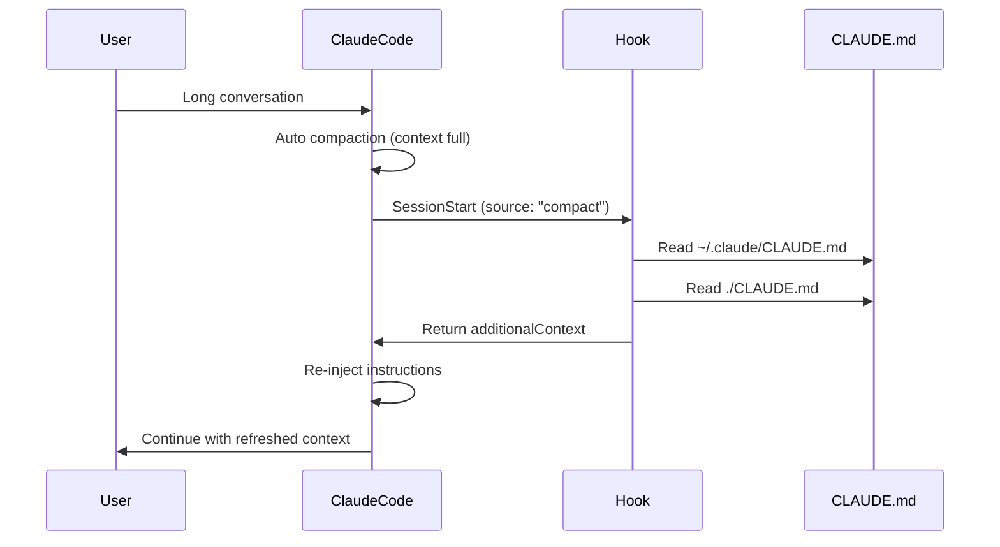

# Post-Compaction CLAUDE.md Refresh

## Problem

During long Claude Code sessions with multiple conversation compactions (summarizations), the CLAUDE.md instructions injected at session start can get lost or diluted, causing **instruction drift** where Claude no longer follows project/global guidelines.

## Context

- **Compaction**: Claude Code automatically compresses conversation history when approaching context window limits
- **CLAUDE.md**: Project and global instruction files that guide Claude's behavior
- **Issue**: Claude Code does NOT have a `PostCompact` hook (see GitHub Issue #3612)
- **Workaround**: Use `SessionStart` hook with `matcher: "compact"` which fires AFTER compaction

## Solution

Implemented a `SessionStart` hook that:
1. Detects when session resumes after compaction (`source: "compact"`)
2. Rereads both global (`~/.claude/CLAUDE.md`) and project (`./CLAUDE.md`) files
3. Re-injects them into context as `additionalContext`

## Implementation

### Hook Script
**Location**: `.claude/hooks/refresh_claude_md_after_compact.py`

**Key Features**:
- Reads `~/.claude/CLAUDE.md` (global instructions)
- Reads `./CLAUDE.md` (project instructions)
- Wraps content in `<claudeMd>` tags for clarity
- Returns via `hookSpecificOutput.additionalContext`
- Exits 0 on error to avoid blocking session

### Hook Registration
**Location**: `~/.claude/settings.json`

```json
{
  "hooks": {
    "SessionStart": [
      {
        "matcher": "compact",
        "hooks": [
          {
            "type": "command",
            "command": "C:\\venvs\\mcp\\Scripts\\python.exe C:\\Projects\\claude-family\\.claude\\hooks\\refresh_claude_md_after_compact.py",
            "timeout": 3000
          }
        ]
      }
    ]
  }
}
```

**Matcher**: `"compact"` - only fires when session resumes after compaction

## How It Works



## Benefits

1. **Prevents instruction drift** - Guidelines stay consistent across compactions
2. **Automatic** - No manual intervention required
3. **Transparent** - Works in background without user awareness
4. **Safe** - Exits gracefully on errors without blocking session
5. **Portable** - Can be deployed to any Claude Code project

## Testing

### Manual Test
```bash
# In a Claude Code session
/compact

# Verify hook fired by checking:
# 1. Session continues normally
# 2. Claude still follows CLAUDE.md instructions
```

### Validation Queries
After compaction, test if Claude still knows:
- Project name
- Database schema name
- Key procedures
- Coding standards

## Limitations

1. **Hook script location**: Currently hardcoded path to claude-family project
   - **Fix**: Deploy to `C:\\claude\\shared\\hooks\\` for global use

2. **No verification**: Hook doesn't verify content was actually re-injected
   - **Fix**: Add debug logging or confirmation message

3. **Windows-specific paths**: Uses backslashes in command path
   - **Fix**: Use platform-agnostic path handling

4. **No .claude/CLAUDE.md support**: Only reads root CLAUDE.md
   - **Fix**: Also check `.claude/CLAUDE.md` in project

## Future Enhancements

1. **Deploy globally**: Move script to shared hooks directory
2. **Add logging**: Log compactions and CLAUDE.md refresh events to database
3. **Read all CLAUDE.md hierarchy**: Include `.claude/CLAUDE.md`, parent directories
4. **Configurable refresh**: Allow projects to opt-in/opt-out
5. **Metrics**: Track instruction drift before/after implementation

## Related

- [[claude-hook-response-format]] - How to format hook output
- [[claude-code-hooks-overview]] - All available hook types
- GitHub Issue #3612 - Request for PostCompact hook
- GitHub Issue #11629 - CLAUDE.md persistence through compaction

## References

- Hook implementation: `.claude/hooks/refresh_claude_md_after_compact.py`
- Settings config: `~/.claude/settings.json`
- Hook docs: https://code.claude.com/docs/en/hooks.md

---

**Status**: ✅ Implemented (2025-12-23)
**Next**: Test in production session, monitor for instruction drift
---

**Version**: 1.0
**Created**: 2025-12-26
**Updated**: 2025-12-26
**Location**: 30-Patterns/post-compaction-claude-md-refresh.md